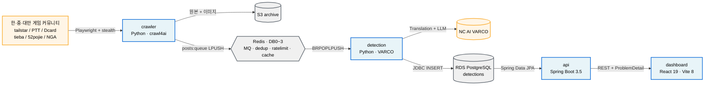

# Tracker

> 불법 프로그램 탐지 AI — NC AI 게임 보안 담당자를 위한 자동화된 불법 프로그램 유포 탐지 시스템

[](https://github.com/byungju0/261RCOSE45700/actions/workflows/ci.yml)
[](https://github.com/byungju0/261RCOSE45700/actions/workflows/deploy.yml)
[](https://github.com/byungju0/261RCOSE45700/commits)
[](https://github.com/byungju0/261RCOSE45700/pulls)
[](https://github.com/byungju0/261RCOSE45700/issues)
[](https://github.com/byungju0/261RCOSE45700)
[](https://github.com/byungju0/261RCOSE45700/wiki)

한·중·대만 게임 커뮤니티 6개 사이트를 1시간 주기로 자동 크롤링하고, NC AI VARCO Translation/LLM 파이프라인으로 다국어 텍스트를 한국어로 번역·분류해, React 대시보드에서 담당자가 확인하고 원본 URL 로 즉시 이동해 조치하는 흐름을 **5분 이내 SLA** 로 보장합니다.

## 목차

- [시스템 개요](#시스템-개요)
- [프로젝트 구조 개요](#프로젝트-구조-개요)
- [사전 요구사항](#사전-요구사항)
- [로컬 셋업](#로컬-셋업)
- [빠른 검증](#빠른-검증)
- [서브시스템별 구현 현황](#서브시스템별-구현-현황)
  - [crawler (Epic 2)](#crawler-epic-2)
  - [detection (Epic 3)](#detection-epic-3)
  - [api (Epic 4 백엔드)](#api-epic-4-백엔드)
  - [dashboard (Epic 4 프론트엔드)](#dashboard-epic-4-프론트엔드)
- [Redis DB 구성](#redis-db-구성)
- [CI/CD](#cicd)
- [스프린트 현황](#스프린트-현황)
- [문서](#문서)
  - [Wiki](#wiki-byungju0261rcose45700wiki)

## 시스템 개요



자세한 결정 근거는 [Architecture Overview (Wiki)](https://github.com/byungju0/261RCOSE45700/wiki/Architecture-Overview) 또는 [`_bmad-output/planning-artifacts/architecture.md`](_bmad-output/planning-artifacts/architecture.md) 참조.

## 프로젝트 구조 개요

본 저장소는 4개 서브시스템 + 공유 모듈로 구성된 **모노레포**입니다.

```
.
├── crawler/          # Python — crawl4ai 크롤링 + 전처리 + Dockerfile (Story 5.2)
├── detection/        # Python — VARCO Translation/LLM AI 탐지 + Dockerfile (Story 5.2)
├── api/              # Java Spring Boot 3.5 — REST API (PG + Flyway) + Dockerfile (Story 5.2)
├── dashboard/        # React 19 + Vite 8 — 운영자 대시보드 + Dockerfile (Story 5.2)
├── shared/           # Python 공유 모듈 (CorrelationId, CrawlEvent, VarcoInterface 등)
├── infra/            # 로컬 docker-compose.yml (Redis+PG) + production compose.prod.yml
│                       + docker-secret-shim.sh + grafana/prometheus placeholder (5.1 예정)
├── docs/             # ci-setup.md (Branch protection) + deployment.md (자동 배포 runbook)
├── tests/            # 크로스 컴포넌트 테스트 (fixtures/e2e/performance/chaos)
└── .github/workflows/  # 6 워크플로우: crawler/detection/api/dashboard (path-filtered)
                          + ci.yml (aggregator) + deploy.yml (GHCR + EC2 SSH)
```

## 사전 요구사항

- **Python 3.11+** (검증: 3.11, 3.12, 3.13)
- **Java 21 LTS** (Gradle Foojay Toolchain Resolver가 자동 다운로드 가능)
- **Node.js 20.19+** (LTS 권장: 20, 22)
- **Docker + Docker Compose** (로컬 Redis/PostgreSQL 환경)

> Java 21이 로컬에 없어도 `./gradlew build` 첫 실행 시 Foojay 리졸버가 자동으로 다운로드합니다.
>
> **Windows 사용자:** `bin/` 경로 대신 `Scripts\` 경로를 사용하고, `./gradlew` 대신 `gradlew.bat`을 사용하세요. 아래 명령은 macOS/Linux 기준입니다.

## 로컬 셋업

신규 팀원이 저장소를 클론한 뒤 실행하는 표준 절차입니다.

```bash
git clone https://github.com/byungju0/261RCOSE45700.git
cd 261RCOSE45700

# 0) 인프라 기동 (Redis + PostgreSQL)
cp infra/.env.example infra/.env   # DB_PASSWORD 등 값 입력
docker compose -f infra/docker-compose.yml up -d

# 1) crawler 셋업 (Python venv + 의존성 + crawl4ai Chromium)
python3 -m venv crawler/.venv
crawler/.venv/bin/pip install -r crawler/requirements.txt
crawler/.venv/bin/playwright install chromium
# Linux headless 환경 추가: crawler/.venv/bin/playwright install-deps chromium

# 2) detection 셋업 (Python venv + 의존성)
python3 -m venv detection/.venv
detection/.venv/bin/pip install -r detection/requirements.txt
cp detection/.env.example detection/.env   # VARCO_API_KEY 등 값 입력

# 3) api 셋업 (Spring Boot — Gradle이 의존성 자동 다운로드, Flyway가 스키마 자동 생성)
cd api && ./gradlew build; cd ..

# 4) dashboard 셋업 (Vite + React)
cd dashboard && npm install && cd ..
```

각 서브시스템의 가상환경/의존성 캐시(`.venv/`, `node_modules/`, `.gradle/`, `build/`)는 git에서 제외되며, 위 명령으로 각 개발자 머신에서 동일하게 재현됩니다.

## 빠른 검증

각 서브시스템이 셋업되었는지 확인하는 명령:

```bash
# crawler (단위 테스트)
cd crawler && .venv/bin/python -m pytest tests/unit/ -q; cd ..

# detection (단위 테스트 — 외부 네트워크/실제 Redis 불필요)
cd detection && .venv/bin/python -m pytest tests/unit/ -q; cd ..

# api
cd api && ./gradlew build; cd ..
# 출력: BUILD SUCCESSFUL

# dashboard
cd dashboard && npm run build; cd ..
# 출력: ✓ built in <time>
```

## 서브시스템별 구현 현황

### crawler (Epic 2)

**Status:** done — 2-1~2-5 모두 머지 완료 (코드 리뷰 14+19 patch 적용, 통합 81+56 tests PASS)

| 모듈 | 설명 |
|------|------|
| `src/crawl4ai_crawler.py` | crawl4ai 기반 크롤러 (Chromium headless, stealth 모드) |
| `src/sites/registry.py` | SiteConfig 레지스트리 (8 사이트: 52pojie / inven_maple / inven_lineage_classic / PTT / Dcard / tieba / NGA / tailstar) |
| `src/preprocessor/` | 언어 감지(`langdetect`) → 중복 제거(`posts:dedup` Redis SHA-256 SET) → 직렬화 (키워드 필터는 commit `17d88ed` 비활성화) |
| `src/queue/redis_publisher.py` | RedisPublisher — `posts:queue` (DB0) LPUSH |
| `src/s3_uploader.py` | S3Uploader — 원본 HTML + 이미지 아카이브 |
| `src/scheduler/` | APScheduler AsyncIOScheduler + TriggerListener(`crawl:trigger`) |
| `Dockerfile` | Story 5.2 — `python:3.11-slim` + Playwright Chromium + tini + secret-shim, `pgrep` 헬스체크 |

### detection (Epic 3)

**Status:** in-progress (mockup 단계 완료, VARCO 실 API 명세 대기). 단위+통합 32 tests PASS (fakeredis[lua] + MagicMock + VarcoMock).

| 모듈 | 설명 | 상태 |
|------|------|------|
| `src/consumer/` | Redis 큐 소비자 (BRPOPLPUSH) + Watchdog (stale → re-queue / DLQ / corrupt-DLQ) | done |
| `src/pipeline/translate.py` | VARCO Translation API (zh-CN/zh-TW → ko, ko 패스스루) + 토큰 버킷 rate limit (Redis DB2 Lua atomic) | review (mockup) |
| `src/pipeline/llm_classifier.py` | VARCO LLM 분류 + RetryHandler (exponential backoff 1s/2s/4s, 4회 실패 시 DLQ) | review (mockup) |
| `src/pipeline/detection_pipeline.py` | 번역 → 분류 → RDS 저장 오케스트레이션 | review (mockup) |
| `src/mocks/varco_mock.py` | VARCO Mock 서버 (4 모드: clean / illegal / rate_limited / timeout) | done |
| RDS 저장 (Story 3-4) | 탐지 결과 PostgreSQL 저장 (`(post_id, model_version)` UNIQUE 멱등성) | backlog |
| `Dockerfile` | Story 5.2 — `python:3.11-slim` + tini + secret-shim, `pgrep` 헬스체크 | done |

### api (Epic 4 백엔드)

**Status:** Story 4-1 / 4-2 done · Story 4-3 PR #27 진행 중

| 항목 | 설명 |
|------|------|
| Spring Boot 3.5 + PostgreSQL | JPA + Flyway (V1~V4 마이그레이션 자동 적용) |
| `GET /api/detections` | 탐지 목록 조회 (페이지네이션 + 필터, `confidence >= 0.70` 자동 적용, `confidence DESC` 정렬) — Story 4-1 done |
| `GET /api/detections/{id}` | 탐지 상세 조회 (RFC 9457 ProblemDetail + `errorCode: "DETECTION_NOT_FOUND"`) — Story 4-2 done |
| `POST /api/crawl/trigger` | 수동 크롤링 트리거 (Redis pub/sub `crawl:trigger` publish) — Story 4-2 done |
| `GET /api/stats` | 통계 (오늘 / 주간 / 월간 + 사이트·유형·언어 분포) — Story 4-3 backlog (PR #27) |
| Swagger UI | `/swagger-ui.html` 에서 API 문서 확인 |
| `Dockerfile` | Story 5.2 — multi-stage `eclipse-temurin:21-jdk-noble` builder → `21-jre-noble` runtime, `/actuator/health` curl 헬스체크 |

### dashboard (Epic 4 프론트엔드)

**Status:** done (5/5 페이지) — 디자인 시스템 v10 overhaul (PR #9, 24 patch) 완료

| 페이지/기능 | 설명 |
|------------|------|
| Dashboard (`/`) | 탐지 현황 요약 + 차트 2종 |
| Detection List (`/detections`) | 목록 + 필터 + 키보드 네비게이션 (j/k/enter/o/c/esc/g+t/g+d/g+l/g+s) |
| Detection Detail (`/detections/:id`) | 원문·번역문 이중 패널 (BilingualPanel) + 신뢰도 배지 |
| Stats (`/stats`) | 주간/월간 추이 LineChart + 사이트별 BarChart + 유형별 PieChart |
| 디자인 시스템 | Tailwind v4 + shadcn/ui + NC AI 브랜드 토큰 (WCAG AA 2-tier) |
| MSW v2 Mock | 백엔드 미완성 엔드포인트 대체 (개발/테스트용) |
| `Dockerfile` | Story 5.2 — multi-stage `node:20.19-alpine` builder → `nginx:1.27-alpine` runtime, `/healthz` 응답 |

## Redis DB 구성

| DB | 용도 | 키 패턴 |
|----|------|--------|
| DB0 | 메시지 큐 | `posts:queue`, `posts:processing`, `posts:dlq` |
| DB1 | 중복 제거 | `posts:dedup` (SHA-256 SET) |
| DB2 | Rate Limit | `varco:rate_limit:*` (토큰 버킷 Lua script) |
| DB3 | API 캐시 | `cache:detections` |

## CI/CD

`.github/workflows/` 에 6개 워크플로우가 구성되어 있습니다 (Story 1.5 + Story 5.2):

| 파일 | 트리거 | 내용 |
|------|--------|------|
| `crawler.yml` | push/PR (`crawler/**`) + `workflow_call:` | pytest 단위 테스트, flake8 |
| `detection.yml` | push/PR (`detection/**`) + `workflow_call:` | pytest 단위 테스트, flake8 |
| `api.yml` | push/PR (`api/**`) + `workflow_call:` | Gradle build + JUnit 테스트 |
| `dashboard.yml` | push/PR (`dashboard/**`) + `workflow_call:` | npm build + lint |
| **`ci.yml`** | PR + push:main (no path filter) | 4 reusable lint-test 호출 + `aggregator` 잡 (`ci / aggregator` strict required check) |
| **`deploy.yml`** | push:main + workflow_dispatch | BuildKit cache mode=max → GHCR push (`:sha` + `:latest`) → `appleboy/ssh-action` → EC2 SSH 배포 + 60s healthcheck + 자동 롤백 |

자세한 사양은 [CI/CD Pipeline (Wiki)](https://github.com/byungju0/261RCOSE45700/wiki/CI-CD-Pipeline) 또는 [docs/deployment.md](docs/deployment.md) (운영 절차) 참조.

## 스프린트 현황

| Epic | 설명 | 상태 |
|------|------|------|
| Epic 1 | 프로젝트 토대 및 인프라 | **완료** (회고 done) |
| Epic 2 | 자동 크롤링 및 전처리 파이프라인 | **완료** |
| Epic 3 | AI 기반 탐지 파이프라인 | 진행 중 (mockup, 3-4 / 3-5 예정) |
| Epic 4 | 탐지 결과 조회 및 통계 대시보드 | 진행 중 (프론트엔드 5/5 done · 백엔드 4-1 / 4-2 done · 4-3 PR #27 진행) |
| Epic 5 | 운영·모니터링·프로덕션 배포 | 진행 중 (5-0 SPIKE done · 5-3 ClickOps PIVOT closed · **5-2 in-progress, [PR #28](https://github.com/byungju0/261RCOSE45700/pull/28)** · 5-1 / 5-4 예정) |

자세한 스토리별 상태: [Sprint Status (Wiki)](https://github.com/byungju0/261RCOSE45700/wiki/Sprint-Status) 또는 [`sprint-status.yaml`](_bmad-output/implementation-artifacts/sprint-status.yaml)

> **Story 5.3 인프라 — 2026-05-06 ClickOps PIVOT.** 학생 IAM 자격증명 통로 0개(IAM Access Key + CloudShell + IAM Role 생성 모두 차단)로 Terraform 폐기, 콘솔 ClickOps로 전환. Terraform 코드는 git history(`b7e24d3`, `bd172d9`)에 보존 — 학생 계정 사용 기간 종료 후 개인 계정에서 1회 apply 로 동일 인프라 재현 가능.
>
> **Story 5.2 자동 배포 — 2026-05-07 SSH `.pem` PIVOT.** OIDC + IAM Role + Access Key + CodeDeploy 모두 봉인된 학생 IAM SCP 환경에서 GHA → GHCR push → `appleboy/ssh-action` 으로 EC2 SSH 직결 자동 배포 + 60초 healthcheck + 자동 롤백. 단일 EC2 t3.xlarge 16GB (5컨테이너 합반). 자세한 흐름은 [docs/deployment.md](docs/deployment.md).

## 문서

### 기획·아키텍처 (`_bmad-output/planning-artifacts/`)

- [PRD](_bmad-output/planning-artifacts/prd.md) — 제품 요구사항 정의서 (FR1~32, NFR1~17)
- [Architecture](_bmad-output/planning-artifacts/architecture.md) — 시스템 아키텍처 결정 문서
- [Epics](_bmad-output/planning-artifacts/epics.md) — 에픽 및 스토리 분해
- [UX Specification](_bmad-output/planning-artifacts/ux-design-specification.md) — UX 설계 명세

### 진행 / 운영 (`_bmad-output/implementation-artifacts/` + `docs/`)

- [Sprint Status](_bmad-output/implementation-artifacts/sprint-status.yaml) — 스프린트 진행 현황
- [Deferred Work](_bmad-output/implementation-artifacts/deferred-work.md) — 보류 항목 트래킹 (31건)
- [docs/deployment.md](docs/deployment.md) — 자동 배포 runbook (Story 5.2)
- [docs/ci-setup.md](docs/ci-setup.md) — CI / Branch protection 가이드
- [infra/DATA_POLICY.md](infra/DATA_POLICY.md) — 수집 데이터 사용·공개 정책 (NFR9)

### Wiki ([byungju0/261RCOSE45700/wiki](https://github.com/byungju0/261RCOSE45700/wiki))

19페이지 통합 문서 — 제품 / 아키텍처 / 서브시스템별 구현 / 운영 / 회고. 가독성을 위한 핵심 결정 정리 뷰입니다.

| 카테고리 | 페이지 |
|---|---|
| 제품 / 아키텍처 | [Product Overview](https://github.com/byungju0/261RCOSE45700/wiki/Product-Overview) · [Architecture Overview](https://github.com/byungju0/261RCOSE45700/wiki/Architecture-Overview) · [UX Design System](https://github.com/byungju0/261RCOSE45700/wiki/UX-Design-System) |
| 시작 | [Getting Started](https://github.com/byungju0/261RCOSE45700/wiki/Getting-Started) |
| 서브시스템 | [Shared Module](https://github.com/byungju0/261RCOSE45700/wiki/Shared-Module) · [Crawler](https://github.com/byungju0/261RCOSE45700/wiki/Crawler) · [Detection](https://github.com/byungju0/261RCOSE45700/wiki/Detection) · [Backend API](https://github.com/byungju0/261RCOSE45700/wiki/Backend-API) · [Frontend Dashboard](https://github.com/byungju0/261RCOSE45700/wiki/Frontend-Dashboard) |
| 인프라 / 운영 | [Infrastructure](https://github.com/byungju0/261RCOSE45700/wiki/Infrastructure) · [CI/CD Pipeline](https://github.com/byungju0/261RCOSE45700/wiki/CI-CD-Pipeline) |
| 진행 / 품질 | [Sprint Status](https://github.com/byungju0/261RCOSE45700/wiki/Sprint-Status) · [Implementation Readiness](https://github.com/byungju0/261RCOSE45700/wiki/Implementation-Readiness) · [Deferred Work](https://github.com/byungju0/261RCOSE45700/wiki/Deferred-Work) |
| 회고 | [Epic 1 Retrospective](https://github.com/byungju0/261RCOSE45700/wiki/Epic-1-Retrospective) · [Epic 4 Frontend Retrospective](https://github.com/byungju0/261RCOSE45700/wiki/Epic-4-Frontend-Retrospective) |
