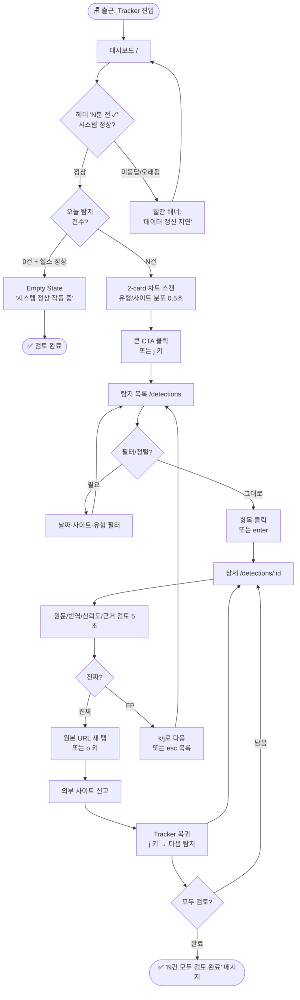
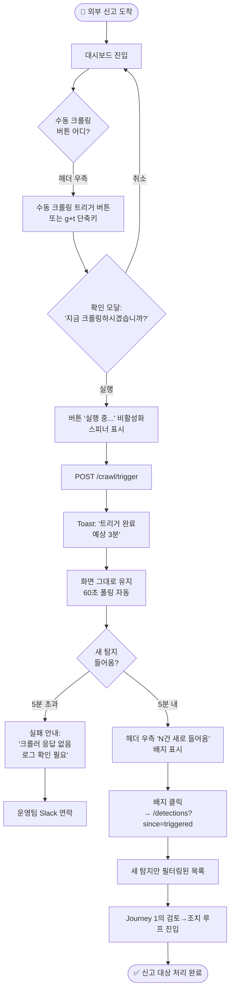
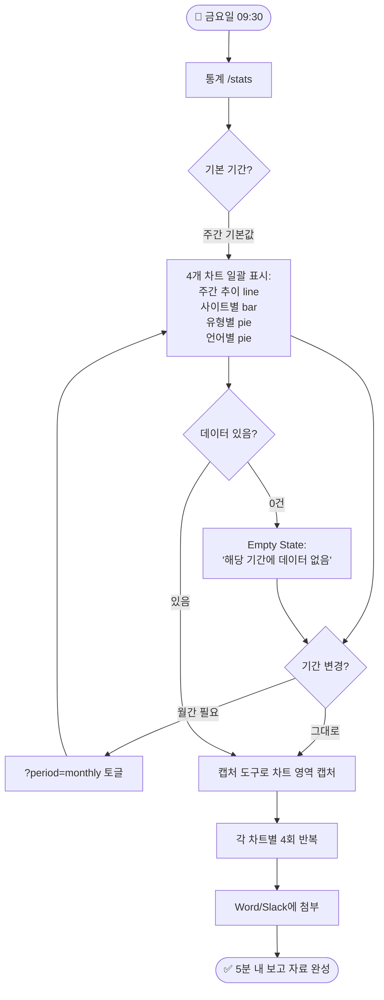

# UX Design Specification — Tracker

**Author:** Tracker
**Date:** 2026-04-27

---

## Executive Summary

### Project Vision

Tracker는 NC AI 게임 보안팀이 한국·대만·중국 게임 커뮤니티에서 유포되는 불법 프로그램(매크로 판매·핵 배포·계정 거래·리세마라·기타) 게시글을 AI(VARCO Translation + LLM)가 자동으로 1차 걸러내고, 보안 담당자가 대시보드에서 **확인 → 원본 URL 이동 → 조치**까지 5분 내에 끊김 없이 수행할 수 있도록 지원하는 사내 운영 도구다.

핵심 가치는 다음 셋이다:

1. **언어 장벽 해체** — 중국어·번체 원문과 한국어 번역을 한 화면에 나란히 노출해 담당자가 외부 번역기를 거치지 않고 검토 가능
2. **AI 신뢰도 임계값(0.70) 기반 잡음 제거** — 시스템이 확신하지 못하는 결과는 자동 필터링, 화면에 뜨는 항목은 곧 "한 번은 봐야 한다"는 신호
3. **5분 SLA로 보장되는 데이터 신선도** — 크롤링 완료부터 대시보드 반영까지 5분 이내, "새로고침 한 번이면 최신"이라는 신뢰감

MVP 성공 조건은 *Precision ≥ 0.85의 명확한 불법 게시글 탐지 + 담당자가 대시보드에서 목록을 보고 URL로 이동해 조치 가능*이다. 11주, 3인팀(크롤링·AI / 백엔드 / 인프라·프론트) 구성.

### Target Users

**Primary — 보안 담당자 (이수현 가칭)**

- 역할: 매일 일상 모니터링 + 긴급 시 수동 크롤링 트리거
- 사용 빈도: 매일
- 언어: 한국어 원어민, 중국어 게시판은 번역에 의존
- 환경: 사내망(VPC) 데스크톱 1280px+ 기본 / 외부 출장·이동 시 모바일(< 768px) (2026-05-13 모바일 편입), Chrome/Edge 최신 2버전 (모바일은 Chromium 계열)
- 핵심 작업: 어제·오늘 탐지 결과 검토 → 원본 URL 이동 → 외부 조치 (이동 중 알림 수신 시 모바일에서 카드 뷰 + 햄버거 drawer 로 동일 흐름 수행 가능)
- 인증: 없음 (네트워크 레벨 접근 제어로 대체)

**Secondary — 보안 팀장**

- 역할: 주간·월간 통계 보고 자료 작성
- 사용 빈도: 주 1회 (금요일 오전)
- 핵심 작업: 통계 화면 → 차트 캡처 → 보고서 첨부
- 시간 압박: 별도 집계 요청 없이 5분 내 완료가 목표

**Tertiary — 운영자(개발팀 본인 포함)**

- 역할: 파이프라인 헬스 모니터링 (Grafana 별도 도구 + 대시보드 일부 시그널)
- 사용 빈도: 이상 신호 감지 시
- 핵심 작업: "0건"이 정상 상태인지 시스템 장애인지 판별

### Key Design Challenges

**1. 신호 vs 잡음의 구분 (컨텍스트 결핍)**

"오늘 12건"만으로는 비상인지 평소인지 판단 불가. 7일 평균 5건인데 12건 vs 매일 10건씩 나오는 시스템에서 12건은 완전히 다른 의미다. 화면이 절대 수치가 아닌 **상대적 컨텍스트**를 제공해야 한다.

**2. 시스템 신뢰성 가시화 (Empty State 모호성)**

"오늘 0건" — 잘 막고 있는 정상 상태인가, 크롤러 장애인가? 운영 도구는 자기 자신의 건강 상태를 보여줘야 사용자가 데이터를 신뢰할 수 있다. 헤더 또는 상단 영역에 *"파이프라인 정상 / 마지막 크롤링 N분 전 / 다음 예정 N분 후 / 큐 깊이"* 같은 헬스 시그널이 필수.

**3. 다국어 원문의 시각적 처리 (피로도 관리)**

중국어·번체 원문 옆에 한국어 번역. 두 언어를 한 화면에 두면 자칫 어수선해진다. 폰트 선택, 행간, 좌우 분할 비율, 원문/번역 강약 — 매일 이걸 보는 사람의 피로도를 좌우하는 디테일.

**4. 색상 시스템 충돌 방지 (의미 분리)**

신뢰도 배지(🔴 High ≥0.8 / 🟡 Medium 0.5-0.8 / ⚫ Low <0.5, Story 4.5)와 탐지 유형 5종(매크로_판매, 핵_배포, 계정_거래, 리세마라, 기타) 둘 다 색상이 필요하다. 같은 화면에서 두 색상 시스템이 의미를 흐리지 않도록 분리해야 한다.

**5. "AI 추천 → 사람 확인" 워크플로우의 시각화 (검증 유도)**

신뢰도 점수, 판단 근거 텍스트, 원문/번역문을 모두 보여주되, 화면이 "AI가 결정했으니 끝"으로 보이면 안 된다. 정보 구조가 *AI 추천을 절대화하지 않고, 사람의 최종 검증을 자연스럽게 유도*해야 한다.

### Design Opportunities

**1. 운영 도구 미학(Operational Tool Aesthetic)**

Sentry, Grafana, Linear 수준의 무게감 있는 타이포그래피·색감으로 "제대로 된 도구를 쓰고 있다"는 사용자 자존감을 형성한다. 사내 운영 도구라고 부트스트랩 스타일일 필요 없다. 정밀함이 신뢰를 만든다.

**2. 검토 → 조치 단축 경로**

기본 흐름은 *목록 → 클릭 → 상세 → 원본 URL 이동* 4스텝이지만, *목록에서 호버 시 빠른 미리보기 + 인라인 조치 버튼* 같은 패턴으로 단축 가능. 매일 사용하는 도구이므로 작은 단축이 누적되면 큰 시간 절약이 된다.

**3. 시간 인식 디자인(Time-aware UI)**

5분 SLA를 활용해 *"방금 들어온 탐지"*를 시각적으로 강조 — 신선도가 곧 가치. 새 탐지에 살짝 다른 색·아이콘·미세 애니메이션을 부여해 "이건 따끈따끈한 거"라는 신호를 줄 수 있다.

**4. 시스템 헬스 인디케이터(Operational Trust Layer)**

헤더 또는 상단 영역에 *"마지막 크롤링 / 다음 예정 / 큐 깊이"* 노출로 0건 상황에서도 신뢰성 확보. 운영 도구의 기본 매너이자 Tracker의 차별 포인트.

---

## Core User Experience

### Defining Experience

Tracker의 핵심 경험은 단 한 문장으로 정의된다 — **"오늘 탐지된 게시글 중 진짜 조치 대상을 5분 안에 가려내고 원본 URL로 점프하기"**. 모든 화면·컴포넌트·상호작용은 이 흐름을 빠르게·정확하게·피로 없이 만드는 데 봉사한다.

핵심 루프(Critical Loop):

```
[1] 한눈에 본다       →  [2] 의심 가는 걸 골라낸다  →  [3] 검증한다  →  [4] 조치한다
   대시보드(/)            탐지 목록(/detections)        상세(/detections/:id)   원본 URL 이동
```

각 단계에서 1초의 마찰이 누적되면 매일 30분, 1년이면 100시간의 손실. 반대로 각 단계에서 1초의 단축이 곧 가치다.

### Platform Strategy

| 항목 | 결정 | 근거 |
|---|---|---|
| 렌더링 | SPA (Single Page Application) | PRD L230 — 인증 없는 내부 도구, SEO 불필요 |
| 브라우저 | Chrome / Edge 최신 2버전 (데스크톱 + 모바일 Chromium 계열) | PRD L231 + 2026-05-13 모바일 편입 |
| 화면 크기 | 1280px+ Primary / 768px+ Secondary (모바일) / 1024-1279px Best-effort | PRD L233 (2026-05-13 PIVOT) — 외부 운영자 모바일 긴급 조치 요구 |
| 입력 방식 | 마우스 + 키보드 (데스크톱) / 터치 + 햄버거 drawer (모바일) | 2026-05-13 PIVOT — Tailwind `md` 768px breakpoint 분기 |
| 인증 | 없음 (네트워크 레벨 접근 제어로 대체) | PRD L235 |
| 오프라인 | 불필요 (PWA manifest는 설치성/홈스크린 목적, runtime cache는 정적 자산만) | vite-plugin-pwa 도입(Story 4.7) — API 응답은 캐시 차단 |
| 색 모드 | **라이트 + 다크 2-tier** | 2026-05-13 PIVOT — 디자인 시스템 v10 NC AI 브랜드 토큰이 라이트/다크 양쪽 정의됨. `next-themes` + `data-theme` + FOUC 가드(`index.html` 인라인 스크립트)로 활성 |

**2026-05-13 PIVOT 메모.** 이전 결정("MVP 단일 라이트 / 모바일 미고려")은 폐기. 디자인 시스템 v10 NC AI 브랜드 토큰이 라이트/다크 양쪽으로 정의되면서 다크 모드가 자연스럽게 활성화 가능해졌고, 외부 운영자의 모바일 긴급 조치 요구가 더해지며 768px+ 지원이 필요해짐. 두 변화 모두 Story 4.7로 묶어 처리.

### Effortless Interactions

다음 동작은 사용자가 의식하지 않아도 시스템이 자동 처리한다:

1. **60초 폴링 자동 갱신** — `useQuery({ refetchInterval: 60_000 })` ([architecture L211](_bmad-output/planning-artifacts/architecture.md#L211))
2. **ISO 시간 → 한국어 상대 시간 자동 변환** — `"2026-04-27T14:30:00Z"` → `"3분 전"`
3. **신뢰도 0.70 미만 자동 필터링** — FR22, 시스템이 잡음 제거
4. **중국어 원문 + 한국어 번역 자동 병기** — 사용자가 "번역 보여줘" 클릭 불필요
5. **시스템 헬스 자동 표시** — 헤더에 "마지막 크롤링 N분 전 / 다음 예정 N분 후 / 큐 깊이 N건" 상시 노출
6. **URL 기반 라우팅으로 필터 상태 자동 보존** — UX-DR6, 북마크 공유 가능
7. **수동 크롤링 트리거 진행 상태 자동 추적** — 버튼 누르면 완료까지 화면이 알아서 알림

### Critical Success Moments

| # | 순간 | 시간 | 성공 기준 |
|---|------|------|-----------|
| 1 | 첫 인상 — 대시보드 진입 | 3초 | "지금 비상인가, 평소인가?" 한눈에 답 |
| 2 | 의심 항목 발견 — 목록 스캔 | 0.5초 | 고위험 탐지가 시각적으로 즉시 부각 |
| 3 | 검증 완료 — 상세 화면 | 5초 | 원문+번역+신뢰도+근거로 즉시 판단 |
| 4 | 조치 완료 — 외부 이동 | 1클릭 | 원본 URL 새 탭 이동 + 링크 복사 옵션 |
| 5 | 시스템 신뢰 회복 — 0건 상황 | — | 헬스 시그널로 정상 상태임을 보장 |

이 다섯 순간 중 하나라도 무너지면 도구의 가치가 즉시 떨어진다. 특히 Moment 1·5는 매일 첫 진입에서 마주하는 순간이라 신뢰의 baseline이다.

### Experience Principles

앞으로 모든 디자인 결정의 잣대가 되는 5가지 원칙:

> **P1. Context over Numbers (절대 수치보다 컨텍스트)**
> "오늘 12건"보다 "평소보다 +140%"가 더 가치 있다. 모든 수치는 비교 기준과 함께 표시한다.

> **P2. System Trust First (시스템 신뢰가 우선)**
> 데이터를 신뢰하려면 시스템을 신뢰해야 한다. 파이프라인 헬스 시그널을 항상 노출한다.

> **P3. Reduce Friction in the Critical Loop (핵심 루프의 마찰 최소화)**
> 매일 반복되는 대시보드 → 목록 → 상세 → 조치 흐름에서 단 1초도 낭비되지 않게 한다.

> **P4. AI Recommends, Human Decides (AI 추천, 사람 결정)**
> AI 판단을 절대화하지 않는다. 신뢰도·근거·원문이 항상 함께 보이게 해서 사람의 검증을 자연스럽게 유도한다.

> **P5. Operational Tool Aesthetic (운영 도구다운 무게감)**
> 사내 도구라고 부트스트랩 스타일일 필요 없다. Sentry/Grafana 수준의 정밀한 타이포그래피와 절제된 색감으로 사용자에게 "제대로 된 도구"라는 자존감을 준다.

---

## Desired Emotional Response

### Primary Emotional Goals

Tracker가 사용자에게 일으켜야 할 감정은 **운영 도구의 감정**이다. 컨슈머 앱의 "흥분"이 아니라, 매일 반복 가능한 작업의 토대가 되는 조용한 감정들이다.

| 우선순위 | 감정 | 의미 |
|---|---|---|
| 1순위 | **Confidence (통제감)** | "이 도구를 *내가* 쓰고 있다 — 도구가 나를 휘두르는 게 아니다" |
| 2순위 | **Trust (신뢰)** | AI 추천을 합리적으로 믿을 수 있다 + 시스템이 살아있다는 확신 |
| 3순위 | **Calm Focus (차분한 집중)** | 매일 반복되는 작업이 피곤하지 않다, 평정을 유지한다 |
| 4순위 | **Quiet Competence (조용한 유능함)** | "나는 전문가다, 이 도구도 전문가용이다" 자존감 |
| 5순위 | **Validation (검증된 성취)** | 진짜 위협을 잡았을 때 조용한 만족감 |

### Emotions to Avoid

| 회피 대상 | 위험 발생 조건 |
|---|---|
| **Anxiety (불안)** | "내가 뭐 놓치고 있나?" — 헬스 시그널 부재, 정보 분산 시 |
| **Confusion (혼란)** | 신뢰도 색상과 유형 색상 충돌, 차트 의미 모호 |
| **Distrust (불신)** | AI 판단 근거 부재, 신뢰도 표기 없음 |
| **Powerlessness (무력감)** | 수동 통제 수단 부재, 진행 상태 깜깜이 |
| **Fatigue (피로)** | 정보 밀도 과다, 다국어 가독성 저하 |
| **Delight (흥분)** | ❌ 운영 도구의 감정 아님. 흥분 = 비일상 = 피로의 전조 |

특히 **Delight 의도적 회피**가 흔한 컨슈머 디자인과 다른 점이다. Tracker는 "반복 가능한 도구"가 되어야 하고, 그건 "은은한 만족감"으로 충분하다.

### Emotional Journey Mapping

이수현 씨의 하루:

```
[09:00 출근] → [09:01 Tracker]   → [09:02 대시보드]   → [09:03 목록]
   호기심        차분한 집중         통제감 + 신뢰         정확한 인지
   (낮은 긴장)    "시스템 정상"        "비상 아님 / 12건"    "이건 진짜, 이건 FP"

→ [09:08 상세 5건]  → [09:14 조치 5건]  → [09:15 종료]
   판단 자신감          조용한 성취감         평정의 마무리
   "AI 추천 합리적"      "5건 처리 완료"       "오늘 일 일단락"
```

**예외 시나리오의 감정**:

- *"오늘 0건"을 봤을 때*: 헬스 시그널 정상 → **안도감** / 헬스 시그널 부재 → **불안**
- *FP 발견 시*: 근거가 함께 보임 → AI에 대한 **합리적 신뢰 유지** / 근거 부재 → **AI 불신**
- *시스템 다운 시*: 명확한 에러 메시지 + 다음 단계 안내 → **통제감 유지** / 흰 화면 → **무력감**
- *수동 트리거 시*: 진행 상태 표시 → **자신감** / 깜깜이 → **불안 + 의심**
- *재방문 시*: 시스템이 어디까지 봤는지 보여줌 → **즉시 컨텍스트 회복**

### Design Implications

| 원하는 감정 | 디자인 결정 |
|---|---|
| **Confidence (통제감)** | • 명확한 정보 위계 — *"가장 중요한 것"*이 시각적으로 도드라짐<br>• 모든 액션에 0.3초 내 즉각적 피드백<br>• 시스템 상태 항상 파악 가능 (헬스 인디케이터)<br>• 키보드 인터랙션 (`/` 검색, `j/k` 목록 탐색 등) |
| **Trust (신뢰)** | • AI 판단 근거 항상 노출 (신뢰도 + 근거 + 원문/번역)<br>• 시스템 헬스 시그널 상시 표시<br>• correlation_id 기반 데이터 출처 추적<br>• 명시적 신뢰도 표기 (0.92 숫자 + 색상 배지) |
| **Calm Focus (차분한 집중)** | • 절제된 색감 — 채도 낮은 그레이 + 강조 색 1-2개<br>• 의미 없는 애니메이션 배제, 상태 변화에만 미세 트랜지션<br>• 정보 밀도 균형<br>• 화면당 강조점 1개 |
| **Quiet Competence (조용한 유능함)** | • 모노스페이스 폰트 (타임스탬프, ID, 신뢰도 숫자)<br>• 8px 베이스 그리드 + 일관된 간격 시스템<br>• 분석 도구 스타일 차트 (인포그래픽 X)<br>• 절제된 타이포그래피 (큰 헤딩 남발 X) |
| **Validation (검증된 성취)** | • 조치 완료 시 작은 토스트 (3초, 화면 막지 않음)<br>• "오늘 처리한 건수" 누적 카운터 (절제된 위치)<br>• 새 탐지에 미세한 시각 강조 (시간 인식 디자인) |

**Confusion 회피 (가장 중요한 negative)**:

- 신뢰도 색상(채도 있는 의미 색) ↔ 유형 색상(무채색 + 아이콘)으로 시각 채널 분리
- 모든 차트에 명시적 단위와 기간 표시 ("탐지 건수 / 오늘")
- Empty State에 명확한 의미 부여 ("0건 — 시스템 정상" vs "0건 — 크롤러 점검 중")

### Emotional Design Principles

> **EP1. Design for Trust, Not Excitement**
> 흥분이 아니라 신뢰가 운영 도구의 통화다. 매일 쓰는 도구는 조용히 일을 잘하는 도구여야 한다.

> **EP2. Quiet Competence over Loud Success**
> 큰 박수보다 작은 끄덕임. 성공 토스트도 조용히, 카운터도 절제된 위치에. 사용자의 일상에 침투하지 않는다.

> **EP3. Honest about System State**
> 시스템이 정상이면 정상이라고, 죽었으면 죽었다고 솔직하게 알린다. 거짓 안심은 나중의 큰 불신을 만든다.

> **EP4. Routine Should Feel Routine**
> 매일 반복되는 작업은 매일 같은 자리에서, 같은 방식으로. 일관성이 곧 평정심이다.

> **EP5. AI Visible, Not Authoritative**
> AI의 판단은 항상 *제안*의 형태로 시각화한다. "확정"처럼 보이면 사용자는 검증을 멈추고 신뢰는 무너진다.

---

## UX Pattern Analysis & Inspiration

### Inspiring Products Analysis

Tracker는 운영 도구이며, 사용자는 매일 같은 도구를 쓰는 보안 분석가다. "새로운 시각 언어"를 발명하기보다 **운영 도구 카테고리에서 이미 검증된 패턴**을 선별·차용한다. 학습 곡선 단축 + 익숙함이 곧 신뢰.

**Sentry — 에러 모니터링**

*가져올 것: "비상인가, 평소인가" 시각 언어*

- Issue 목록의 시각적 위계 (빈도 + 임팩트 + 신선도) → Tracker의 신뢰도 0.95 매크로_판매 시각화
- Frequency sparkline (각 항목 옆 7일 추이 미니 그래프) → P1 컨텍스트 표시 패턴
- Stale state 표기 ("3분 전 / 2시간 전") → 시간 인식 디자인
- 무채색 + 빨강 1색의 절제 → P5 Operational Aesthetic

**Grafana — 메트릭 모니터링**

*가져올 것: 시스템 헬스 시그널의 상시 표기*

- Status bar 헤더 고정 ("Sources up: 6/6 | Last scrape: 12s ago") → P2 System Trust First
- 큰 숫자 + 비교 컨텍스트 ("42 req/s ↑ 12% vs 1h ago") → P1 Context over Numbers
- No-data state 정직함 ("No data points") → EP3 Honest about System State
- 분석 도구 차트 (그리드 + 축 라벨 + 단위) → P5 Operational Aesthetic

**Linear — 이슈 트래커**

*가져올 것: 키보드 인터랙션 + 정밀한 미니멀*

- 키보드 네비게이션 (`j/k` 목록, `enter` 상세, `e` 빠른 액션) → P3 Friction 감소
- Quick command palette (⌘K) — Growth 단계 백로그
- List → Detail 슬라이드 (페이지 깜빡임 X)
- 모노스페이스(ID·숫자·시간) + 시스템 폰트(본문) 절제된 조합 → EP4 Quiet Competence

### Transferable UX Patterns

**Navigation Patterns**

- 키보드 단축키 우선 (`/`, `j/k`, `enter`) — Linear 차용
- URL 기반 필터 상태 보존 — UX-DR6 (이미 결정사항)

**Information Display Patterns**

- 큰 숫자 + 비교 델타 + sparkline — Grafana/Sentry 융합
- Stale time 표기 ("3분 전") — Sentry
- No-data state with reason — Grafana
- 모노스페이스 숫자/ID — Linear

**Visual Patterns**

- 절제된 색상 시스템 (무채색 + 강조 1-2색) — Sentry
- 분석 도구 차트 스타일 (인포그래픽 X) — Grafana
- 8px 베이스 그리드 — Linear

### Anti-Patterns to Avoid

| 안티 패턴 | 어디서 보이는가 | 위반하는 원칙 |
|---|---|---|
| Cluttered information density | Splunk, 일부 SIEM | EP3 Calm Focus, P3 Friction |
| Infographic-style charts (3D 파이, 그라디언트) | Tableau 일부 템플릿, Power BI | P5 Operational Aesthetic |
| Excessive notifications / 배지 남용 | 기업용 SaaS 일반 | EP2 Quiet Competence |
| Hidden system state | 단순 CRUD 어드민 | EP3 Honest about System State |
| AI as authoritative ("AI says: ILLEGAL") | 일부 AI assistant 도구 | EP5 AI Visible, Not Authoritative |
| Modal-heavy flows | 부트스트랩 어드민 템플릿 | P3 Friction |
| Color overload (모든 게 컬러풀) | 기업용 BI 도구 | P1 Color separation |
| Default Recharts look | 흔한 React 대시보드 | P5 — *현재 4.4 구현이 이 함정에 빠진 상태* |

### Design Inspiration Strategy

**What to Adopt (그대로 차용)**

| 패턴 | 출처 | Tracker 적용 |
|---|---|---|
| Status bar 헤더 고정 | Grafana | 마지막 크롤링·다음 예정·큐 깊이 상시 노출 |
| Frequency sparkline | Sentry | 탐지 카드/항목 옆 7일 미니 추이 |
| No-data 정직함 | Grafana | "0건 — 정상" vs "0건 — 점검 중" 구분 |
| Stale time 표기 | Sentry | "3분 전", "방금" 같은 상대 시간 |
| 모노스페이스 숫자/ID | Linear | 신뢰도, post_id, 타임스탬프 |

**What to Adapt (우리식 변형)**

| 원본 | 변형 |
|---|---|
| Sentry "frequency + impact + new" 3축 | Tracker의 "신뢰도 + 유형 + 신선도" 3축 |
| Linear ⌘K 명령 팔레트 | MVP는 단축키만 (`/`, `j/k`, `enter`), 팔레트는 Growth 단계 |
| Linear list-detail 슬라이드 | URL 분리 유지 (UX-DR6 결정사항). 호버 미리보기는 Story 4.5에서 검토 |
| Grafana 시계열 차트 | Recharts 기반에 Grafana 톤(그리드·축·무채색) 입히기 |

**What to Avoid**

- Splunk-style dense data tables (1행 7열 이상 빽빽함)
- Tableau-style infographic charts (3D, 그라디언트)
- Bootstrap admin template look (Recharts 기본값 그대로 X)
- Modal-driven flows (모달은 진짜 차단 필요시만)
- Notification spam (토스트는 3초·작게·조용히)

---

## Design System Foundation

### Design System Choice

**선택: Tailwind CSS v4 + shadcn/ui (style: "new-york")**

Tracker는 Tailwind CSS v4를 utility-first 스타일링 기반으로 사용하고, shadcn/ui의 "new-york" 스타일 컴포넌트를 Radix Primitives 위에 입혀 베이스 컴포넌트 시스템을 구성한다. shadcn은 npm 라이브러리가 아닌 **코드 복사 방식**이므로 모든 컴포넌트는 `src/components/ui/`에 직접 위치하며 자유롭게 수정 가능하다.

### Rationale for Selection

**1. 영감 도구들과 동일 스택**
Linear, Vercel Dashboard, Sentry 모두 Tailwind 기반. P5 Operational Tool Aesthetic을 직접 입을 수 있는 유일한 선택.

**2. 이미 부분 채택됨**
`@radix-ui/react-select`가 `dependencies`에 이미 존재. shadcn은 Radix Primitives 위에 빌드되므로 자연스러운 확장이지 새 채택이 아님.

**3. 코드 복사 방식의 자유**
shadcn은 npm 의존성이 아니라 코드를 프로젝트에 복사. 버전 lock 없음, 완전한 커스터마이즈 가능. *Default Recharts look* 같은 안티 패턴을 처음부터 회피.

**4. 11주 단독 작업의 현실성**
검증된 베이스 + Tracker만의 색·타이포 입힘 = 속도와 정밀함의 균형.

**5. Recharts 통합 용이**
Tailwind CSS 변수를 Recharts에 주입해 차트와 UI가 같은 색 시스템 공유.

### Implementation Approach

**Phase 1 — 기반 셋업 (~1일)**

```bash
# Tailwind v4 (Vite 8 호환)
npm install -D tailwindcss @tailwindcss/vite

# shadcn/ui 초기화
npx shadcn@latest init
# Style: new-york
# Base color: zinc
# CSS variables: yes
```

- `vite.config.ts`에 `@tailwindcss/vite` 플러그인 추가
- `src/index.css`에 `@import "tailwindcss"` 및 `@layer base` 정의

**Phase 2 — 디자인 토큰 정의**

- shadcn semantic tokens (background, foreground, primary, muted, border, ring 등)
- Tracker 전용 신뢰도 토큰: `--confidence-high` (≥0.8), `--confidence-med` (0.5~0.8), `--confidence-low` (<0.5)
- Tracker 전용 차트 팔레트: `--chart-1` ~ `--chart-5` (탐지 유형 5종 매핑)
- 폰트 변수: `--font-sans` (Pretendard), `--font-mono` (JetBrains Mono)

**Phase 3 — 컴포넌트 점진 도입**

```bash
# 필수 1차
npx shadcn@latest add button card table dialog \
  select skeleton

# 선택 2차 (필요 시)
npx shadcn@latest add tabs sonner drawer
```

**2026-05-13 정정.** `badge` / `tooltip` / `separator` primitive는 도입 후 제거(working tree 삭제). 사유:
- `badge` → 도메인 전용 `ConfidenceBadge` / `NewDetectionsBadge`로 흡수 (variant 분기보다 명시적 컴포넌트가 의미 명확)
- `tooltip` / `separator` → 실제 사용처가 누적 1~2건에 그쳐 Tailwind utility로 직접 처리 (`border-t`, `aria-label` + native title) — 의존성 축소
- `sheet` → `drawer` (vaul)로 대체 (모바일 bottom drawer 패턴 + 햄버거 navigation drawer 통합)
- `toast` → `sonner` (shadcn 권장 후속작)

**Phase 4 — Story 4.4 코드 마이그레이션 (~1-2시간)**

- 인라인 스타일 → Tailwind 클래스
- 공통 컴포넌트(`LoadingSpinner`, `ErrorBoundary`, `RefreshIndicator`)를 shadcn `<Skeleton>`, `<Alert>`, `<Badge>` 활용해 재구성
- `Card` 래핑으로 `TodayCount`, `TypeDistribution`, `SiteDistribution` 정돈
- Recharts 색상을 CSS 변수(`hsl(var(--chart-1))`)로 주입

**Phase 5 — 폰트 적용**

- Pretendard CDN (한글 본문, Inter 한글판 위치)
- JetBrains Mono (Google Fonts) → ID·숫자·타임스탬프 → EP4 Quiet Competence

### Customization Strategy

**색상 시스템 (가장 중요)**

- shadcn `zinc` 기반 무채색 팔레트 → P5 Operational Aesthetic
- 신뢰도 색상은 별도 토큰 (`--confidence-*`) → P1 색상 시스템 분리
- 탐지 유형은 *무채색 + 아이콘*으로 시각 채널 분리 → EP1 Confusion 회피
- 차트 팔레트는 `--chart-*` 토큰 → Tailwind와 Recharts 통합

**타이포그래피**

- 본문: Pretendard (system-ui fallback)
- 숫자/ID/타임스탬프: JetBrains Mono → EP4 Quiet Competence
- 8px 베이스 그리드 (Tailwind 기본 spacing scale 활용)

**다크 모드 (2026-05-13 활성화)**

- 디자인 시스템 v10 NC AI 브랜드 토큰이 라이트/다크 양쪽으로 정의되며, 사용자 선호에 따라 토글 가능
- 구현: `next-themes` + `data-theme` 속성 + `index.html` FOUC 가드 인라인 스크립트(localStorage('theme') → prefers-color-scheme → light)
- 차트 팔레트(`--chart-1`~`--chart-5`)도 라이트/다크 양쪽 정의
- ~~Growth 단계 백로그~~ 결정은 폐기 (이전: "shadcn dark token 정의만, `.dark` 클래스 미적용")

---

## Defining Experience

### The Defining Interaction

Tracker의 정체성은 단 한 가지 인터랙션에 응축된다:

> **"탐지 상세 화면에서 원문·번역·신뢰도·근거를 한 호흡에 검토하고 5초 안에 *진짜/FP* 판단을 내린 뒤 1클릭으로 조치한다."**

이 동작이 사용자가 친구에게 Tracker를 설명할 때의 답이며, 도구의 차별점이 가장 강하게 드러나는 순간이다. 핵심 루프(대시보드 → 목록 → 상세 → 조치) 중 **"3번 검증"** 단계에서만 AI의 추천과 사람의 판단이 만난다. 여기가 흔들리면 나머지 모든 화면이 무의미해진다.

### User Mental Model

보안 담당자의 5초 내 사고 흐름:

```
1. 신뢰도 + 유형 인지        → "AI는 매크로 판매로 0.95 신뢰"
2. 원문 스캔                  → "중국어 원문 — 게임 스크립트 판매"
3. 번역 대조                  → "한국어 번역 일치"
4. 근거 확인                  → "AI 근거 합리적"
5. 결정                        → "진짜다, 외부 신고로 진행"
```

**기존 방식의 고통점**:

- 게시판 직접 방문 + 외부 번역기 사용 → 평균 2-3분/건
- 신뢰도/근거 부재 → 매번 처음부터 판단
- 브라우저 탭 5-6개로 컨텍스트 스위칭

**Tracker가 깨는 부분**: 모든 정보가 한 화면, 한 호흡.

### Success Criteria

| # | 성공 신호 | 지표 |
|---|---|---|
| 1 | "이거면 충분 — 추가 검색 불필요" | 평균 검토 시간 ≤ 5초 (체감) |
| 2 | "AI 판단 합리적" | 신뢰도+근거 확인 후 사용자 동의율 ≥ 80% |
| 3 | "내가 통제 — AI는 보조" | 단순 클릭이 아닌 검토 후 판단 (EP5) |
| 4 | "조치 1클릭" | 상세 진입 → 외부 이동 ≤ 7초 |
| 5 | "다음으로 자연스럽게" | 조치 후 다음 탐지 자동 또는 1키 이동 |

5가지 중 하나라도 무너지면 도구는 *"한 번 쓰고 마는 신기한 것"* 으로 남는다. 매일 쓰는 도구가 되려면 5개 모두 만족해야 한다.

### Novel UX Patterns

**Established 차용 (검증된 패턴)**

- Master-detail 레이아웃 (GitHub/Linear/Sentry 표준)
- 상단 메타데이터 + 본문 구조
- 신뢰도 색상 배지 — 🔴 High (≥0.8) / 🟡 Medium (0.5~0.8) / ⚫ Low (<0.5) (Story 4.5 AC)
- 외부 URL `target="_blank"` 표준
- 우측/상단 action panel

**Novel — Tracker 고유 패턴**

**1. 다국어 Side-by-Side Rendering** (시그니처 인터랙션)

```
┌─────────────────────────────────────────────────────────┐
│  原文 (中文)                  │  번역 (한국어)           │
│                              │                         │
│  这个游戏脚本可以让你         │  이 게임 스크립트을(를)  │
│  自动刷副本，价格优惠...      │  사용해 자동으로 던전을  │
│                              │  돌 수 있어요. 특가...   │
└─────────────────────────────────────────────────────────┘
```

- 좌우 50:50 분할 (1280px 데스크톱 기준 충분)
- 단락 정렬 동기화 (원문 1단락 ↔ 번역 1단락)
- 원문은 시스템 중국어 폰트, 번역은 Pretendard
- `line-height: 1.7` (가독성)
- 한국어 게시글의 경우 분할 비활성화, 단일 컬럼 전체 폭 사용

**2. Trust-Visible Confidence Header**

```
┌─────────────────────────────────────────────────────────┐
│  🔴 0.95  매크로_판매          tieba.baidu.com  3분 전   │
│  ────────────────────────────────────────────────────  │
│  AI 판단 근거                                           │
│  "게임 자동화 도구의 가격이 명시되어 있고 구매 안내가   │
│   포함되어 있어 매크로 판매로 판단됨"                   │
└─────────────────────────────────────────────────────────┘
```

- 신뢰도 + 유형 + 사이트 + 시간 + AI 근거를 한 줄에 통합
- 위 → 아래 자연스러운 시선 흐름 유도
- 호버 시 임계값 0.70 정책 설명 툴팁 (사용자 교육)

**3. One-Key Action 단축키**

| 키 | 동작 | 의도 |
|---|---|---|
| `o` | 원본 URL 새 탭 열기 (Open) | 조치 즉시 실행 |
| `c` | URL 복사 (Copy) | 다른 채널로 공유 |
| `j` | 다음 탐지로 이동 (next) | 검토 흐름 유지 |
| `k` | 이전 탐지로 (prev) | 되돌아가기 |
| `esc` | 목록 복귀 | 컨텍스트 종료 |

마우스 0회로 *검토 → 조치 → 다음* 가능. **운영자스러움의 정수**.

### Experience Mechanics

**1. Initiation (진입)**

- 트리거: 목록 행 클릭 / `enter` / 직접 URL (북마크·공유 — UX-DR6)
- 로드 시간: ≤ 500ms (NFR1과 정렬)

**2. Interaction (상호작용) — F-pattern 시선 흐름**

| 시점 | 보는 것 | 위치 |
|------|---------|------|
| 0.5초 | 신뢰도 + 유형 | 좌측 상단 |
| 1초 | AI 판단 근거 | 헤더 아래 정렬 |
| 3-4초 | 원문 / 번역 | 메인 분할 영역 |
| 4-5초 | 출처 · 시간 · 액션 | 하단 / 우측 |

**상호작용 가능 요소**

- 신뢰도 배지 → 호버 시 임계값 정책 툴팁
- 원문 텍스트 → 선택 가능 (복사 후 추가 검색)
- 외부 URL → 클릭 시 새 탭 + 방문 표시
- "조치 완료" 버튼 → 백엔드 상태 기록 (Story 4.5 이후)

**3. Feedback (피드백)**

- 즉각 응답 (≤ 0.3초): 키 누름 시각적 응답, URL 방문 표시
- 조치 후 토스트 (2-3초): "외부 사이트 이동", "링크 복사됨"
- 페이드 트랜지션 (250ms): 다음 항목 자동 이동

**4. Completion (완료)**

- 외부 사이트 이동 → 새 탭에서 처리 후 Tracker 복귀
- 다음 항목 자동 이동 → URL 변경 + 동일 레이아웃 유지
- `esc` → 목록 복귀, 검토 완료 시각적 표시
- 모든 탐지 완료 시 → *"오늘 12건 모두 검토 완료"* 메시지

---

## Visual Design Foundation

### Color System

#### Base Palette — Zinc (shadcn new-york)

shadcn `"new-york"` + base color **zinc**. Slate보다 살짝 차갑고 모던한 톤으로 Linear/Vercel과 동일한 미학.

**Light mode tokens (MVP)**

| Token | Light Value | Use |
|---|---|---|
| `--background` | `#ffffff` | 카드/모달 배경 |
| `--page-background` | `zinc-100` (`#f4f4f5`) | 페이지 배경 |
| `--foreground` | `zinc-950` (`#09090b`) | 본문 텍스트 |
| `--muted` | `zinc-100` | 비강조 영역 |
| `--muted-foreground` | `zinc-500` (`#71717a`) | 메타 텍스트 |
| `--border` | `zinc-200` (`#e4e4e7`) | 구분선 |
| `--card` | `#ffffff` | 카드 배경 |
| `--primary` | `zinc-900` (`#18181b`) | 주 액션 버튼 |
| `--ring` | `zinc-400` | focus ring |

#### Semantic Colors

| Token | Value | Use |
|---|---|---|
| `--destructive` | `red-600` (`#dc2626`) | 위험·삭제 |
| `--warning` | `amber-500` (`#f59e0b`) | 주의 |
| `--success` | `green-600` (`#16a34a`) | 정상 |
| `--info` | `blue-600` (`#2563eb`) | 정보 |

#### Tracker Confidence (P1 색상 시스템 분리)

| Token | Value | 의미 |
|---|---|---|
| `--confidence-high` | `red-600` (`#dc2626`) | ≥0.8 — "위험" |
| `--confidence-medium` | `amber-500` (`#f59e0b`) | 0.5~0.8 — "주의" |
| `--confidence-low` | `zinc-500` (`#71717a`) | <0.5 — 보조용 (임계값 0.70 미만이라 일반적으로 미노출) |

#### Detection Type — 의도적 무채색 + 아이콘 (EP1 Confusion 회피)

색상 채널 사용 안 함. lucide-react 아이콘 + 한글 라벨로 구분:

| 유형 | 아이콘 | 라벨 |
|---|---|---|
| 매크로_판매 | `Bot` 또는 `Code2` | 매크로 판매 |
| 핵_배포 | `AlertTriangle` | 핵 배포 |
| 계정_거래 | `ShoppingCart` | 계정 거래 |
| 리세마라 | `RefreshCw` | 리세마라 |
| 기타 | `Circle` | 기타 |

#### Chart Palette (식별 전용 — 의미적 위계 없음)

| Token | Value | 매핑 |
|---|---|---|
| `--chart-1` | `violet-500` (`#8b5cf6`) | 매크로_판매 |
| `--chart-2` | `blue-500` (`#3b82f6`) | 핵_배포 |
| `--chart-3` | `teal-500` (`#14b8a6`) | 계정_거래 |
| `--chart-4` | `orange-500` (`#f97316`) | 리세마라 |
| `--chart-5` | `zinc-500` (`#71717a`) | 기타 |

채도(70~95%)와 명도(40~60%)를 비슷하게 맞춰 *어떤 색이 더 위험하다는 의미적 위계가 없도록* 설계. **위험은 confidence 색상이 담당, 차트는 식별만 담당.**

### Typography System

#### Type Scale (운영 도구 표준 — 본문 14px)

| Token | Size | Line Height | Weight | Use |
|---|---|---|---|---|
| `display` | 40px | 48px (1.2) | 700 | Empty State, Hero |
| `h1` | 28px | 36px (1.3) | 600 | 페이지 타이틀 |
| `h2` | 22px | 32px (1.45) | 600 | 섹션 헤딩 |
| `h3` | 18px | 28px (1.55) | 500 | 카드 헤딩 |
| `body` | **14px** | 22px (1.55) | 400 | **본문 (Linear/Sentry/Vercel 표준)** |
| `small` | 12px | 18px (1.5) | 400 | 메타·캡션 |
| `mono` | 13px | 20px (1.55) | 400 | 숫자·ID·타임스탬프 |

운영 도구는 본문 14px가 표준. 16px는 컨슈머 사이즈.

#### Font Stack

```css
--font-sans: 'Pretendard Variable', Pretendard, -apple-system, BlinkMacSystemFont,
             system-ui, Roboto, 'Helvetica Neue', sans-serif;

--font-mono: 'JetBrains Mono', ui-monospace, 'SF Mono', Menlo, Consolas,
             'Liberation Mono', monospace;
```

#### 폰트 사용 매핑

| 요소 | 폰트 |
|---|---|
| 모든 본문, 헤딩, 라벨 | Pretendard |
| 신뢰도 숫자 (`0.95`) | JetBrains Mono |
| 게시글 ID (`tieba-1234567`) | JetBrains Mono |
| 타임스탬프 (`2026-04-27 14:30:00 UTC`) | JetBrains Mono |
| 중국어 원문 (`游戏脚本`) | system-ui CJK fallback |

EP4 *Quiet Competence*의 시각적 표현 — 숫자와 ID는 모노스페이스로 정밀함을 드러낸다.

### Spacing & Layout Foundation

#### 8px 베이스 그리드 (Tailwind 기본 spacing 활용)

| Tailwind | px | rem | Use |
|---|---|---|---|
| `0.5` | 2 | 0.125 | 미세 조정 (border 영역) |
| `1` | 4 | 0.25 | 인라인 아이콘 간격 |
| `2` | 8 | 0.5 | **기본 단위 — 컴팩트 패딩** |
| `3` | 12 | 0.75 | 작은 카드 내부 패딩 |
| `4` | 16 | 1 | 표준 카드 패딩 / 행 간격 |
| `6` | 24 | 1.5 | 섹션 간격 |
| `8` | 32 | 2 | 페이지 좌우 패딩 |
| `12` | 48 | 3 | 큰 섹션 분리 |
| `16` | 64 | 4 | Empty State 여백 |

#### 컴포넌트 패딩 가이드

- 작은 버튼: `px-3 py-1.5`
- 표준 버튼: `px-4 py-2`
- 카드 내부: `p-6`
- 페이지 콘테이너: `px-8 py-6`

#### 페이지 구조 (모든 화면 공통)

```
┌────────────────────────────────────────────────────────┐
│  Header (60px, sticky)                                  │
│  ┌─Tracker──Nav─────────System Health──Refresh─┐       │
│  └─────────────────────────────────────────────┘       │
├────────────────────────────────────────────────────────┤
│                                                          │
│  Main content                                            │
│  max-width: 1280px                                       │
│  padding: 24px (top/bottom) 32px (left/right)            │
│                                                          │
└────────────────────────────────────────────────────────┘
```

#### Grid System

- 콘테이너 max-width: **1280px** (PRD 결정사항)
- 콘테이너 padding: 좌우 32px, 상하 24px
- 컬럼 grid: 12 column, gap 16px (필요 시)
- 카드 grid: `repeat(2, minmax(0, 1fr))` 등 콘텐츠 기반

#### Border Radius

shadcn 기본값: `--radius: 0.5rem` (8px). 카드·버튼·인풋 모두 동일 모서리.

너무 둥근(16px) 모서리는 "앱스러움", 너무 각진(0px) 모서리는 "오래된 기업 도구". **8px가 운영 도구의 정중간 톤**.

#### Layout Principles

1. **1280px 단일 폭** — 반응형 미고려 (PRD 결정)
2. **페이지당 강조점 1개** — P5 Operational Aesthetic
3. **Linear 톤의 정보 밀도** — 너무 빽빽하지도, 비어있지도 않게
4. **카드 기반 그리드** — shadcn `<Card>` 컴포넌트 표준
5. **Header sticky 고정** — 시스템 헬스 항상 노출 (P2 System Trust First)

### Accessibility Considerations

**기준**: PRD L234 — *"내부 도구, WCAG 준수 필수 아님"*. 다만 현실적 베이스라인 유지.

| 항목 | 기준 | Tracker 충족도 |
|---|---|---|
| 본문 대비 | WCAG AAA (≥7:1) | zinc-950 on white = **18.7:1** ✅ |
| 인터랙티브 요소 | WCAG AA (≥4.5:1) | shadcn 기본값 만족 ✅ |
| Focus ring 가시성 | 명확함 | shadcn `--ring` 토큰 활용 ✅ |
| 키보드 네비게이션 | 모든 액션 키보드 접근 가능 | **운영 도구 핵심** — `/`, `j/k`, `enter`, `esc`, `o`, `c` |
| 색약 고려 | 색상만으로 의미 구분 X | 신뢰도(색+아이콘+숫자), 유형(아이콘+라벨) |
| 동적 콘텐츠 알림 | `aria-live` 적절 사용 | 토스트, 시스템 헬스 변경 시 |

**의도적 미고려**:

- 스크린 리더 완전 지원 (내부 분석가 환경, 데스크톱 단일 환경)
- 다크 모드 (Growth 단계 백로그)
- 모바일 접근성 (PRD 미고려)

---

## Design Direction Decision

### Design Directions Explored

세 가지 방향을 비교 평가했다:

**Direction A — "Linear Minimal"**
- 거대한 여백 + 화면당 강조점 1개
- Hero 메트릭 단독 + 작은 차트
- 강점: 평정심·우아함
- 약점: 시스템 헬스 가시성 약함

**Direction B — "Sentry Dense"**
- 정보 밀도 극대화 + 모든 메트릭에 sparkline
- KPI 4개 그리드 + 사이드바 레이아웃
- 강점: 컨텍스트 풍부
- 약점: Calm Focus 위반 위험, 11주 일정 부담

**Direction C — "Grafana Operational"** (초기 추천)
- Status bar 헤더 직하 (Sources/Last crawl/Next/Queue/DLQ/VARCO 6개 메트릭)
- Hero 메트릭 (오늘 N건 + 7일 sparkline + 평균 비교)
- 차트 2개 + Recent 5 detections + mini sparkline
- 강점: P1·P2·EP3 직접 구현
- 약점: 백엔드 의존성 큼 (Epic 5 영역 침범), 11주 안에 야망 과다

### Chosen Direction

**Direction C — Lightweight (확정안)**

Party Mode 라운드(Winston·Amelia·John)를 거쳐 Direction C 원안에서 다음을 수정한 경량화 버전:

| 영역 | 원안 (C) | **확정안 (C-Light)** | 변경 이유 |
|---|---|---|---|
| Hero 큰 숫자 | 56px JetBrains Mono | **28px 한 줄 요약 카드** | John: 대형 메트릭은 actionable 가치 약함 |
| 7일 sparkline + 평균 비교 | 메인 노출 | **→ Stats 화면(4.6)으로 이전** | John: Journey 1 핵심 흐림. 주간 보고용 |
| Status bar | 6개 메트릭 풀 (Sources, Last crawl, Next, Queue, DLQ, VARCO) | **헤더 우측 "18분 전 업데이트 ✓" 1줄** | Winston: Epic 5 의존성 차단. EP1 위반(가짜 헬스 dot) 회피 |
| 차트 2개 (도넛+바) | 유지 | **유지 (PRD AC 요구사항)** | — |
| Recent 5 detections | 메인 하단 리스트 | **"탐지 목록 보러 가기" 큰 CTA로 대체** | John: 5개만 보여주면 어차피 한 번 더 클릭. 마찰 추가 |
| Mini sparkline (각 행) | 채택 | **제거 (4.5에서 재검토)** | Amelia: 4.5 detection 요구사항 보고 결정 |
| 마이그레이션 단위 | Story 4.4 통합 | **4.4(현 상태 dev review 통과) + 4.4.1(디자인 시스템 도입) + 4.4.2(C-Light 재구성) 분할** | Amelia: 8-10시간 작업, AC 추적 위해 분할 |

### Design Rationale

**왜 Direction C-Light인가**

1. **PRD AC 충족** — Story 4.4 AC #1~#5 (오늘 탐지 수, 파이 차트, 바 차트, Empty State, 60초 폴링) 모두 유지

2. **John의 핵심 비판 수용** — *"이 화면을 보고 사용자가 다음에 할 행동이 뭔가?"* 답: **"탐지 목록 보러 가기"**. 시각적 무게 중심을 큰 CTA에 둠. Hero 큰 숫자·sparkline·Recent 5는 *actionable 가치 부족*으로 제거 또는 이전

3. **Winston의 시스템 경계 보호** — Status bar의 시스템 헬스 5개 메트릭은 Epic 5 영역. 4.4 범위에서는 *"마지막 업데이트 N분 전 ✓"* 1줄만 노출 (GET /stats 응답으로 충분히 도출 가능). 가짜 초록 dot으로 *"내가 모르는 걸 안다고 하지 않는다"* 원칙 준수

4. **Amelia의 구현 부담 분리** — 4.4(기능 완료, 인라인 스타일) + 4.4.1(Tailwind/shadcn 도입) + 4.4.2(C-Light 시각 재구성) 3단계 분할. 각 단계 AC 명확

5. **운영 도구 미학 유지** — Pretendard 본문 14px, JetBrains Mono 숫자/시간, zinc 무채색, 8px 그리드, shadcn Card는 그대로. *Quiet Competence* 시각화 불변

**시각적 흐름 (이수현 씨 5초 시나리오)**

```
0.5초: 헤더 우측 "18분 전 ✓"  → 시스템 살아있음 인지
1초:   "오늘 12건 ↑ +3 전일"    → 양감 파악
2초:   유형별 / 사이트별 차트    → 분포 인지
3초:   큰 검은 CTA "탐지 목록 →" → 클릭 → 본격 작업 시작
```

대시보드는 *"본격 작업으로 가는 디딤돌"*. 매일 아침 5초 안에 *"시스템 정상 + 분포 인지 + 목록으로 점프"* 완료.

**Empty State 처리**

오늘 0건일 때는 차트와 CTA 모두 사라지고 다음 메시지로 대체:

```
✓
오늘 탐지된 게시글이 없습니다
시스템 정상 작동 중 · 다음 크롤링: 42분 후
```

*"0건 — 시스템 정상"*과 *"0건 — 점검 중"* 구분. EP3 *Honest about System State* 직접 구현.

### Implementation Approach

**시안 위치**: [_bmad-output/planning-artifacts/ux-design-directions.html](ux-design-directions.html) — 브라우저 직접 미리보기

**스토리 분할 (Amelia 권고)**

| 스토리 | 범위 | 상태 |
|---|---|---|
| **Story 4.4** (현재) | 기능 AC 완료 (인라인 스타일 그대로) | review → done 처리 가능 |
| **Story 4.4.1** (신규) | Tailwind v4 + shadcn/ui init + 디자인 토큰 + 폰트 도입 | 본 스토리 dev 완료 후 차순위 |
| **Story 4.4.2** (신규) | Dashboard 페이지 C-Light 재구성 (요약 strip + 차트 + CTA + Empty State 재설계) | 4.4.1 완료 후 |

**구현 우선순위 (4.4.2 내부)**

1. RootLayout 헤더에 "N분 전 업데이트 ✓" indicator 추가 (60px 유지)
2. Dashboard 페이지 레이아웃 재구성: 요약 strip → 2-card grid → Big CTA
3. CTA 컴포넌트 (`<Link>` to `/detections`, primary background, lucide ArrowRight)
4. Confidence 배지 컴포넌트 — Story 4.5에서 재사용
5. Type 아이콘 매핑 (`lucide-react`)
6. Empty State 분기 처리 (`data.todayCount === 0` 시 차트·CTA 영역 전체 대체)

**Story 4.4.1 백엔드 합의 사항 (Winston 권고)**

- `GET /stats` 응답에 `lastCrawledAt` 필드 추가 합의 (백엔드 영준씨)
- 헬스 시그널은 Epic 5 Story 5.1에서 별도 `GET /health` 엔드포인트로
- MSW mock도 동일 계약으로 작성 → 5.1 완료 시 frontend 변경 0줄

---

## User Journey Flows

세 가지 핵심 여정(PRD 기반)에 대한 상세 흐름과 재사용 패턴을 정의한다.

### Journey 1 — 일상 모니터링 (Primary)

**상황**: 평일 오전 9시. 이수현 씨가 출근해 자리에 앉는다. 어제 새벽~오늘 새벽 사이 무엇이 들어왔는지 확인하고 조치를 끝내야 한다.



**시간 목표**: 12건 기준 10~15분 (1건당 평균 70초 — 검토 5초 + 외부 처리 60초).

**핵심 단축키 (P3)**: `j/k`(다음/이전), `enter`(진입), `o`(원본 열기), `c`(URL 복사), `esc`(목록 복귀).

### Journey 2 — 긴급 대응 (Edge)

**상황**: 외부 신고가 들어왔다. 보안팀 슬랙에 *"방금 OO 사이트에 핵 판매 글 떴다"*. 1시간 다음 자동 크롤링 못 기다림.



**핵심 결정**: 트리거 후 화면을 그대로 유지하고 *완료 시 배지로 알림*. 사용자가 다른 화면 가도 잡혀나옴 (P3 Friction).

**Edge case**: 5분 타임아웃 시 명확한 에러 + 다음 단계. 깜깜이 X (EP3 Honest about System State).

### Journey 3 — 주간 보고 (Operations)

**상황**: 금요일 오전. 보안 팀장이 다음주 임원 보고용 자료를 준비한다. 5분 안에 차트 4개를 캡처해야 한다.



**핵심 결정**: 통계 페이지 진입 시 *기본 기간 = 주간*. 매주 같은 흐름 → 동일 출발점이 평정심 (EP4 Routine Should Feel Routine).

**Out of scope** (PRD 명시): CSV 내보내기, 차트 자동 다운로드 — Growth 단계 백로그.

### Journey Patterns

세 여정을 가로질러 공통 반복되는 패턴 4개 — 4.4·4.5·4.6 모든 화면에 일관 적용한다.

#### Pattern 1 — Header Freshness Indicator (모든 페이지)

대시보드 / 목록 / 상세 / 통계 — 모든 화면 헤더 우측에:

| 상태 | 표기 | 조건 |
|---|---|---|
| 정상 | `[●] 18분 전 업데이트` (초록 dot) | `now - lastUpdated < 5min` |
| 지연 | `[!] 데이터 갱신 지연됨` (빨간 dot) | `now - lastUpdated > 5min` |
| 갱신 중 | `[⟳] 갱신 중...` (회색 스피너) | `isFetching === true` |

**구현**: `RootLayout.tsx`의 `RefreshIndicator` 확장.

#### Pattern 2 — Keyboard Navigation Layer

| 키 | Dashboard | Detection List | Detection Detail | Stats |
|---|---|---|---|---|
| `/` | — | 필터 검색 input focus | — | — |
| `j/k` | — | 다음/이전 행 | 다음/이전 탐지 | — |
| `enter` | — | 선택 행 상세 진입 | — | — |
| `o` | — | — | 원본 URL 열기 | — |
| `c` | — | — | URL 복사 | — |
| `esc` | — | — | 목록 복귀 | — |
| `g + t` | 어디서든 → 수동 크롤링 트리거 모달 | | | |
| `g + d/l/s` | 어디서든 → 대시보드 / 목록 / 통계 점프 | | | |

**구현**: 전역 단축키 hook (`useGlobalShortcut`) — Story 4.5에서 도입.

#### Pattern 3 — Empty State 분기 (Honest System State)

모든 화면에서 *"데이터 없음"* 상황을 두 가지로 구분 (EP3 Honest about System State):

| 상황 | 시각 | 메시지 |
|---|---|---|
| **데이터 없음 + 시스템 정상** | ✓ 초록 체크 | "오늘 탐지된 게시글이 없습니다 / 시스템 정상 작동 중 / 다음 크롤링: N분 후" |
| **데이터 없음 + 시스템 의심** | ⚠ 노란 경고 | "데이터 갱신 지연됨 / 마지막 업데이트: N시간 전 / 운영팀 문의 필요" |

**구현**: 헬스 indicator의 `isStale = (now - lastUpdated) > 5min` 분기.

#### Pattern 4 — Inline Action Feedback (Toast)

| 액션 | 토스트 메시지 | 지속 |
|---|---|---|
| 외부 URL 클릭 | (없음, 새 탭 열림) | — |
| `c` URL 복사 | "링크 복사됨" | 2초 |
| 수동 크롤링 트리거 | "트리거 완료. 예상 3분" | 3초 |
| 트리거 완료 후 신규 탐지 | "N건 새로 들어옴" 헤더 배지 | 클릭 또는 5분 |
| 모든 탐지 검토 완료 | "오늘 N건 모두 검토 완료" | 5초 |
| API 에러 (ProblemDetail) | "오류: {detail} (코드: {errorCode})" | 5초 + 재시도 버튼 |

**구현**: shadcn `<Sonner>` 또는 `<Toaster>` — Story 4.4.1에서 도입.

### Flow Optimization Principles

#### O1. Steps to Value 최소화 (P3 Friction)

| 여정 | 기존 (Tracker 없이) | Tracker | 단축 |
|---|---|---|---|
| Journey 1 (1건 검토) | 평균 2-3분 | 5초 (검토) + 60초 (외부 처리) | **75% 단축** |
| Journey 2 (긴급) | 1시간 (자동 사이클 대기) | 3분 (수동 트리거) | **95% 단축** |
| Journey 3 (보고) | 30분-1시간 (수동 집계) | 5분 (캡처) | **90% 단축** |

#### O2. Cognitive Load 감소 (EP1 Calm Focus)

각 화면에서 *"가장 중요한 다음 행동"* 하나가 시각적으로 부각:

- Dashboard → **큰 검은 CTA 버튼** ("탐지 목록 보러 가기")
- List → **신뢰도 높은 행 (적색 배지)**
- Detail → **원본 URL 버튼** + `o` 키 단축키 안내
- Stats → **기간 토글** (주간/월간)

#### O3. Progress Feedback (EP1 Trust)

모든 비동기 작업에 진행 상태 시각화:

- 60초 폴링 → 헤더 RefreshIndicator
- 수동 크롤링 → 버튼 비활성화 + 스피너 + 완료 토스트
- 페이지 전환 → LoadingSpinner
- 에러 → ErrorBoundary + 재시도 버튼

#### O4. Recovery Paths (EP3 Honest)

모든 에러/Empty 상황에 명확한 다음 단계 제공:

- 크롤러 타임아웃 → "운영팀 Slack 연락" 링크
- API 에러 → ProblemDetail의 `errorCode` 노출 + 새로고침 버튼
- 0건 + 시스템 정상 → 다음 크롤링 시점 안내
- 0건 + 시스템 이상 → 운영팀 문의 안내

---

## Component Strategy

### Design System Components (shadcn에서 import)

`npx shadcn@latest add` 명령으로 `dashboard/src/components/ui/`에 코드 복사. npm 의존성 X. 필요 시점마다 점진 도입.

| 컴포넌트 | 용도 | 사용처 |
|---|---|---|
| `Button` | 모든 액션 | CTA, 헤더, 모달, 폼 |
| `Card` | 콘텐츠 컨테이너 | 차트 카드, 메트릭 카드 |
| `Badge` | 상태/태그 표시 | Confidence, Type 배지 베이스 |
| `Table` | 데이터 테이블 | Detection List |
| `Dialog` | 확인 모달 | 수동 크롤링 트리거 |
| `Sheet` | 사이드 패널 | (Future: 빠른 미리보기) |
| `Select` | 드롭다운 | 필터 (날짜/사이트/유형/언어) |
| `Tooltip` | 호버 도움말 | Confidence 임계값, 헬스 dot |
| `Sonner` (Toast) | 비-blocking 알림 | URL 복사·트리거 완료 |
| `Skeleton` | 로딩 placeholder | 차트·테이블 로딩 |
| `Input` | 텍스트 입력 | 필터 검색 |
| `Tabs` | 탭 전환 | Stats 주간/월간 토글 |
| `Separator` | 구분선 | 섹션 분리 |
| `DropdownMenu` | 컨텍스트 메뉴 | 행 우클릭 액션 (Future) |

### Custom Components (Tracker 전용 12개)

위치: `dashboard/src/components/tracker/` (또는 도메인별 sub-dir)

#### C1. ConfidenceBadge

**목적**: 신뢰도 점수를 시각적으로 즉시 읽히게 (P1 시각 채널 분리)

**Anatomy**:
- `[●] 0.95` — high (red-600 dot, red-tint bg) — score ≥ 0.8
- `[●] 0.78` — medium (amber-500 dot, amber-tint bg) — 0.5~0.8
- `[●] 0.45` — low (zinc-500 dot, zinc-tint bg) — < 0.5

**Props**: `score: number` (0~1) — 자동 high/med/low 판정

**States**: default / hover (툴팁 "임계값 0.70 이상만 표시")

**A11y**: `aria-label="신뢰도 0.95 (높음)"`, `role="status"`

**구현**: shadcn `<Badge>` variant 확장 + cva

#### C2. TypeIcon

**목적**: Detection Type 5종을 무채색 + 아이콘으로 시각 채널 분리 (EP1 Confusion 회피)

| Type | Icon | Label |
|---|---|---|
| `매크로_판매` | `Bot` | 매크로 판매 |
| `핵_배포` | `AlertTriangle` | 핵 배포 |
| `계정_거래` | `ShoppingCart` | 계정 거래 |
| `리세마라` | `RefreshCw` | 리세마라 |
| `기타` | `Circle` | 기타 |

**Props**: `type: DetectionType`, `showLabel?: boolean`

**Variants**: `icon-only` / `icon-label`

#### C3. FreshnessIndicator

**목적**: 시스템 데이터 신선도 + 정상성 한 줄 표시 (P2 System Trust First, EP3 Honest)

**States**:

| 상태 | 표시 | 조건 |
|---|---|---|
| 정상 | `[●] 18분 전 업데이트` (초록 dot + pulse ring) | `now - lastUpdated < 5min` |
| 지연 | `[!] 데이터 갱신 지연됨` (빨간 dot) | `> 5min` |
| 갱신 중 | `[⟳] 갱신 중...` (회색 스피너) | `isFetching` |

**Props**: `lastUpdatedAt: string` (ISO), `isFetching: boolean`

**A11y**: `aria-live="polite"`

**위치**: `dashboard/src/layouts/RootLayout.tsx`에 통합

#### C4. DashboardCTA

**목적**: 메인 대시보드의 시각적 무게 중심 — 목록으로 가는 큰 검은 버튼 (P3 Friction)

**Anatomy**:
```
┌────────────────────────────────────────────────────┐
│ [📋]  탐지 목록 보러 가기                       → │
│       12건 검토 대기 중 · 18분 전 갱신             │
└────────────────────────────────────────────────────┘
```

**Props**: `count: number`, `lastUpdatedAt: string`

**구현**: shadcn `<Button variant="default" size="lg">` + Link 래핑

#### C5. EmptyState

**목적**: "데이터 없음" 상황을 두 가지로 분기 (EP3 Honest about System State)

**Variants**:

```tsx
<EmptyState variant="healthy"
  title="오늘 탐지된 게시글이 없습니다"
  message="시스템 정상 작동 중 · 다음 크롤링: 42분 후" />

<EmptyState variant="stale"
  title="데이터 갱신 지연됨"
  message="마지막 업데이트: 2시간 전 · 운영팀 문의 필요"
  action={<SlackLink />} />

<EmptyState variant="filter-empty"
  title="해당 조건에 맞는 탐지 결과가 없습니다"
  action={<ResetFiltersButton />} />
```

**Props**: `variant: 'healthy' | 'stale' | 'filter-empty'`, `title`, `message`, `action?: ReactNode`

#### C6. DetectionRow (Story 4.5)

**목적**: 탐지 목록 한 행. 키보드 네비·신뢰도·유형·미리보기 통합

**Anatomy**:
```
[●0.95]  📋 매크로 판매  tieba  "游戏脚本..."  3분 전 [→]
```

**States**: default / hover / focused (`j/k` 선택, ring) / visited (검토 완료) / new (트리거 후 신규)

**Props**: `detection: Detection`, `isFocused: boolean`, `onSelect: () => void`

**A11y**: `role="row"`, `tabindex="0"`, `aria-selected`

#### C7. BilingualPanel (Story 4.5) ⭐ 시그니처

**목적**: 원문 + 번역 side-by-side 렌더링 — Defining Experience

**Anatomy**:
```
┌──────────────────────┬──────────────────────┐
│ 原文 (中文)           │ 번역 (한국어)         │
│ ───────────          │ ───────────          │
│ 这个游戏脚本...       │ 이 게임 스크립트...    │
│ (system CJK font)    │ (Pretendard)          │
└──────────────────────┴──────────────────────┘
```

**Props**: `originalText: string`, `originalLang: 'ko' | 'zh-CN' | 'zh-TW'`, `translatedText: string | null`

**Variants**: `bilingual` (한국어 외 원본) / `monolingual` (한국어 원본 시 단일 컬럼 전체 폭)

**A11y**: `lang` 속성 정확히 (`<div lang="zh-CN">`)

#### C8. ChartCard

**목적**: 차트 + Card + Empty State + 로딩 통합 래퍼

**Usage**:
```tsx
<ChartCard
  title="유형별 분포"
  subtitle="오늘 12건 기준"
  loading={isLoading}
  empty={data.length === 0}
  emptyMessage="탐지된 게시글이 없습니다">
  <PieChart data={data} />
</ChartCard>
```

**구현**: shadcn `<Card>` + 자동 분기 (loading → Skeleton, empty → EmptyState, default → children)

#### C9. ManualCrawlButton (Story 4.5)

**목적**: 수동 크롤링 트리거 + 확인 모달 + 진행 추적 (Journey 2)

**Flow**: 클릭 → Dialog 열림 → 확인 → 버튼 비활성화 + 스피너 → Toast "트리거 완료, 예상 3분" → 60초 후 Refetch → 신규 탐지 시 NewDetectionsBadge

**Props**: `onTrigger: () => Promise<void>`

**위치**: 헤더 우측 (모든 페이지 접근, `g+t` 단축키)

#### C10. NewDetectionsBadge

**목적**: 수동 트리거 후 신규 탐지 도착 알림 (Journey 2 보강)

**Anatomy**: `[N건 새로 들어옴 →]` — 헤더 우측 (정상 freshness 자리 임시 대체)

**State**: 5분 노출 후 자동 dismiss / 클릭 시 `/detections?since=triggered`

#### C11. GlobalShortcutProvider (Story 4.5)

**목적**: 전역 키보드 단축키 처리 + Cheatsheet 모달 (Pattern 2)

**Features**:
- `useGlobalShortcut('o', handler)` hook
- `?` 키 → Cheatsheet 모달 (단축키 일람)
- input/textarea focus 시 비활성화
- chord 지원 (`g + t`, `g + d` 등)

**위치**: `dashboard/src/lib/shortcuts.tsx`

#### C12. MiniSparkline (Story 4.5/4.6, deferred)

**상태**: **보류** — Amelia 권고. 4.5 detection 요구사항 보고 결정.

**예상 구현**: Recharts `<LineChart>` + `<ResponsiveContainer>` 단순 래핑

### Component Implementation Strategy

**핵심 원칙**:

1. **shadcn 우선** — 가능한 한 shadcn 기본 + variant. 새로 만드는 건 진짜 필요할 때만
2. **재사용성 ≥ 2회** — 한 곳에서만 쓰는 건 컴포넌트로 추출 X
3. **시각 토큰 중심** — 모든 컴포넌트는 CSS 변수(`--confidence-high` 등) 참조. 하드코딩 색상 X
4. **A11y 베이스라인** — 키보드 네비, ARIA, 색약 고려는 기본
5. **점진적 도입** — 스토리 단위로 컴포넌트 추가. 전체 라이브러리 사전 구축 X

### Implementation Roadmap

#### Story 4.4 (현재, dev review 통과 처리)
이미 인라인 스타일로 기능 완료. 컴포넌트 추가 X.

#### Story 4.4.1 — 디자인 시스템 도입 (신규)
- Foundation: `Button`, `Card`, `Badge`, `Skeleton`, `Sonner`
- Custom: **C3 FreshnessIndicator** (헤더 통합)
- 산출물: Tailwind/shadcn init, 디자인 토큰 등록, 폰트 적용

#### Story 4.4.2 — Dashboard C-Light 재구성 (신규)
- Custom: **C1 ConfidenceBadge**, **C2 TypeIcon**, **C4 DashboardCTA**, **C5 EmptyState**, **C8 ChartCard**

#### Story 4.5 — Detection List + Detail
- Foundation: `Table`, `Dialog`, `Select`, `Tooltip`, `Tabs`, `Separator`
- Custom: **C6 DetectionRow**, **C7 BilingualPanel** ⭐, **C9 ManualCrawlButton**, **C10 NewDetectionsBadge**, **C11 GlobalShortcutProvider**, **C12 MiniSparkline** (필요시)

#### Story 4.6 — Stats
- Foundation: 모두 기존 활용
- Custom: LineChart (ChartCard 통합), 기간 토글 (Tabs)

### Custom 12개 정당화

| # | 컴포넌트 | 정당화 |
|---|---|---|
| C1 | ConfidenceBadge | 모든 detection 표기에 사용. 색상 시스템 분리 핵심 |
| C2 | TypeIcon | 5종 매핑 일관성 (Confusion 회피) |
| C3 | FreshnessIndicator | 모든 페이지 헤더 — Pattern 1 |
| C4 | DashboardCTA | 시각적 무게 중심, John 의견 직접 구현 |
| C5 | EmptyState | 두 분기(healthy/stale) 일관 처리 — Pattern 3 |
| C6 | DetectionRow | List 행 + 키보드 네비 — Pattern 2 |
| C7 | BilingualPanel | **시그니처 — Tracker 정체성** |
| C8 | ChartCard | 차트 4종 공통 래퍼 — 코드 중복 제거 |
| C9 | ManualCrawlButton | Journey 2 핵심 |
| C10 | NewDetectionsBadge | Journey 2 보강 |
| C11 | GlobalShortcutProvider | Pattern 2 — 운영자스러움 |
| C12 | MiniSparkline | (deferred) 4.5 보고 결정 |

---

## UX Consistency Patterns

Step 10에서 4개 패턴(Freshness / Keyboard / Empty State / Toast)을 이미 정의했다. 본 섹션은 *나머지 일상 UX 상황*에 대한 일관성 규칙을 박는다.

### Button Hierarchy

| 레벨 | 모양 | 언제 |
|---|---|---|
| **Primary** | 검은 배경 + 흰 글자 (`zinc-900`) | 화면당 *하나만* — 가장 중요한 다음 행동 |
| **Secondary** | 흰 배경 + 보더 + 검은 글자 | 부차 액션 (취소, 필터 적용) |
| **Ghost** | 배경 없음 + 회색 글자 | 메뉴 항목, 인라인 액션 |
| **Destructive** | red-600 배경 또는 보더 | 되돌릴 수 없는 액션 |
| **Link** | 색만 있음, 호버 시 밑줄 | 외부 URL, 인라인 텍스트 링크 |

**원칙**:

- 화면당 Primary 1개 (Dashboard = "탐지 목록 보러 가기", Detail = "원본 URL 열기")
- 모든 버튼 keyboard focus ring 명확 (shadcn `--ring`)
- Loading state: 비활성화 + 16px 스피너 + "실행 중..."
- Icon-only 버튼: `size="sm" variant="ghost"` + `aria-label` 필수

**구현**: shadcn `<Button>` variant 그대로 활용

### Feedback Patterns

#### Toast (비-차단)

`<Sonner>` 단일 사용. 우상단 또는 우하단.

| 종류 | 색 | 아이콘 | 지속 |
|---|---|---|---|
| Success | 초록 보더 | `CheckCircle2` | 2-3초 |
| Info | 회색 보더 | `Info` | 3초 |
| Warning | 노란 보더 | `AlertTriangle` | 5초 |
| Error (ProblemDetail) | 빨간 보더 | `XCircle` | 5초 + 재시도 액션 |

**금지**: 토스트 안에 액션 2개 이상. 1개만 ("재시도" 또는 "보기").

#### Inline Error (차단)

ProblemDetail 응답 시 폼 필드 옆 또는 카드 하단:

```
⚠ 데이터를 불러오지 못했습니다
코드: STATS_FETCH_FAILED
[재시도]
```

**규칙**:

- `errorCode`는 모노스페이스 폰트, 작게 (운영팀 전달용)
- 재시도 버튼 항상 제공 (Recovery Path — Pattern O4)
- 스택 트레이스 노출 X (ProblemDetail의 `detail` 필드만)

#### System-level Banner (헤더 직하)

페이지 전체 영향 상황:

- "데이터 갱신 지연됨" — Stale (5분 초과)
- "수동 크롤링 진행 중" — Journey 2 트리거 후
- "읽기 전용 모드" — (Future) 점검 시간

빨강·노랑·파랑 보더로 구분. Stale은 dismiss 불가.

### Form Patterns

Tracker는 입력이 적은 도구(필터·검색·확인)지만 일관성을 위해 정의.

#### Field Layout

```
[라벨]
[──── 입력 ────────────────────────]
[작은 도움말 또는 에러 메시지]
```

- 라벨은 *위* (인라인 옆 X)
- 라벨 weight 500, 13px
- 도움말 12px muted, 에러 12px destructive
- 필수 표시 생략 (보안 도구 모든 필드 의미)

#### Validation

- 즉시 검증 X — `onBlur` 또는 submit 시점만
- 잘못된 입력: 빨간 보더 + 하단 에러
- 한국어 메시지 구체적: *"날짜 형식이 올바르지 않습니다"*

#### Filter Layout (Detection List)

```
[날짜: 2026-04-27 ▾] [사이트: 전체 ▾] [유형: 전체 ▾] [언어: 전체 ▾]   [필터 초기화]
```

- 4개 Select 가로 배치
- 변경 즉시 적용 (Apply 버튼 X — Friction 감소)
- 적용 필터는 URL에 반영 (UX-DR6)

### Modal & Overlay Patterns

#### Dialog (확인 모달) — 진짜 차단 시만

shadcn `<Dialog>`. 사용처: 수동 크롤링 트리거 확인, 되돌릴 수 없는 액션.

**규칙**:

- 모달 안 액션 최대 2개 (Primary + Secondary). 3개 이상은 Sheet
- ESC + 백드롭 클릭으로 닫힘
- Primary 우측, Cancel 좌측
- Modal 안에서 Modal 열기 금지

#### Sheet (사이드 패널)

shadcn `<Sheet>`. 사용처(주로 Future): 빠른 미리보기, 단축키 Cheatsheet (`?` 키).

**규칙**: 우측 슬라이드인 (260ms ease-out), ESC 닫힘, 메인 컨텍스트 유지.

#### Tooltip

shadcn `<Tooltip>`. 0.5초 지연.

**금지**: 인터랙티브 요소 안에 정보 숨기기. truncate + tooltip은 OK.

### Loading & Empty States

| 상황 | 패턴 |
|---|---|
| 페이지 첫 로드 | 페이지 중앙 `LoadingSpinner` (size lg) |
| 카드 콘텐츠 로딩 | shadcn `<Skeleton>` 윤곽 |
| 60초 폴링 갱신 중 | 헤더 RefreshIndicator만 (전체 스피너 X) |
| 버튼 액션 진행 | 버튼 비활성화 + 인라인 스피너 |
| 페이지 전환 | 무처리 (instant) 또는 헤더 진행바 (Future) |

**원칙**: 갱신 시 전체 스피너 = Calm Focus 위반. 부분 인디케이터 우선.

**Empty States 3분기** (Pattern 3 재사용):

- `variant="healthy"` — 시스템 정상 + 데이터 없음
- `variant="stale"` — 시스템 의심
- `variant="filter-empty"` — 필터로 결과 없음

모든 Empty State는 *다음 행동* 제시. "없습니다"만으로 끝나지 X.

### Search & Filter Patterns

#### List Filtering (Detection List)

- 즉시 적용 (Apply 버튼 없음)
- URL 동기화 (`?date=&site=&type=&lang=`)
- 결과 카운트: *"필터 적용: 3건 / 12건"*
- Reset 버튼 항상 노출 (필터 1개 이상 활성 시)

#### Search (Future, Story 4.5+)

- `/` 키로 검색 input focus
- Debounce 300ms
- placeholder: *"제목·본문에서 검색"*
- 결과 0건 시 `EmptyState variant="filter-empty"`

### Navigation Patterns

#### Primary Navigation (Header)

- 3개 라우트: 대시보드 / 탐지 목록 / 통계
- 활성 라우트: 진한 글자 + 옅은 배경
- 호버: `bg-page` 배경
- 모바일 (`< lg`) 햄버거 → vaul drawer 슬라이드 (2026-05-13 PIVOT — Story 4.7)

#### Breadcrumb

사용 X. 4개 화면이라 깊이 얕음. 상세 화면에서 "← 목록으로" 인라인 링크 1개만.

#### URL Patterns

```
/                            메인 대시보드
/detections                  탐지 목록 (?date=&site=&type=&lang=&page=)
/detections/:id              상세
/detections?since=triggered  Journey 2 — 트리거 후 신규만
/stats                       통계 (?period=weekly|monthly)
```

**원칙**: URL은 항상 북마크 가능. 필터·정렬·기간 모두 URL 반영.

### Animation & Motion

운영 도구의 Calm Focus를 위해 최소 모션.

| 상황 | 지속 | 이징 |
|---|---|---|
| Hover 색 변화 | 150ms | ease-out |
| 모달 등장 | 200ms | ease-out |
| Sheet 슬라이드 | 260ms | ease-out |
| 페이지 페이드 | 0ms (instant) | — |
| 토스트 등장/소멸 | 200ms / 300ms | ease-in-out |

**금지**:

- 스크롤 패럴랙스
- 의미 없는 entrance 애니메이션
- 1초 이상의 트랜지션
- `prefers-reduced-motion` 미지원 (Tailwind `motion-safe` 활용)

### State Persistence

| 상태 | 저장 위치 | 이유 |
|---|---|---|
| 필터 (날짜/사이트/유형/언어) | URL query params | 북마크·공유·뒤로가기 (UX-DR6) |
| 페이지네이션 (page/size) | URL query params | 동일 |
| 검토 완료 표시 (visited) | sessionStorage | 세션 내 시각 표시. 영구 X |
| 단축키 cheatsheet 열림 | 컴포넌트 state | 새로고침 시 닫힘 |
| 다크 모드 (Future) | localStorage | 사용자 선호 |

**원칙**: 공유 가능한 상태 → URL, 일시적 → 컴포넌트, 사용자 선호 → localStorage.

---

## Responsive Design & Accessibility

> **2026-05-13 PIVOT.** 이전 결정("1280px 단일, 모바일 out-of-scope")은 폐기. 외부 운영자의 모바일 긴급 조치 요구로 < 768px 까지 지원. WCAG 의무 X 베이스라인은 유지.

### Responsive Strategy

#### Breakpoint Strategy

| 환경 | 지원 | 구현 |
|---|---|---|
| 데스크톱 1280px+ | ✅ Primary | 풀 레이아웃 (Sidebar 고정 + 테이블 뷰 + 키보드 단축키) |
| 데스크톱 1024-1279px | ✅ Best-effort | 테이블 뷰 유지, 페이지 max-width 100% (좌우 24px), Filter Select 2x2 wrap |
| 태블릿 768-1023px | ⚠ Best-effort | 데스크톱 레이아웃 유지하되 sidebar는 햄버거(`< lg`) → drawer |
| 모바일 < 768px | ✅ Secondary | DetectionList 카드 뷰 + FilterBar bottom Drawer + 차트 단일 컬럼 stack |

#### Tailwind Breakpoint 사용

```ts
// Tailwind v4 — 기본값 사용
// md: 768px  → 모바일/데스크톱 콘텐츠 분기 (table vs card)
// lg: 1024px → Sidebar 고정 vs 햄버거 drawer
```

- `useIsMobile()` 훅(`window.matchMedia('(max-width: 767px)')`)으로 JS 분기
- Tailwind `md:` / `lg:` 클래스로 CSS 분기 (둘 다 사용)

#### Layout Adaptation

| 요소 | 1280px+ | 1024-1279px | 768-1023px | < 768px |
|---|---|---|---|---|
| 페이지 max-width | 1280px | 100% (좌우 24px) | 동일 | 100% (좌우 16px) |
| Sidebar | 고정 | 고정 | 햄버거 drawer | 햄버거 drawer |
| Dashboard 차트 grid | 2열 | 2열(간격 축소) | 2열 | 1열 stack |
| Detection List | 테이블 | 테이블 (truncate 강하게) | 테이블 | 카드 뷰 (`DetectionCard`) |
| Detection Detail bilingual | 50:50 | 50:50 | 50:50 | stack (원문 → 번역) |
| Filter 4개 | 가로 1줄 | 2x2 wrap | 2x2 wrap | 버튼 → bottom Drawer 전체 패널 |
| 키보드 단축키 | 활성 | 활성 | 활성 | 비활성 |

#### 모바일 진입 정책

`< 768px` 접속 시 정상 카드 뷰 + 햄버거로 진입. 차단 페이지(`<MobileNotSupported />`)는 폐기. ~~이전 결정: "768px 미만 차단 페이지 노출"은 2026-05-13 PIVOT으로 무효~~.

#### 키보드 단축키 vs 터치

데스크톱(`>= 768px`)에서는 j/k/enter/o/c/esc/g+t/g+d/g+l/g+s 단축키 활성. 모바일(`< 768px`)에서는 비활성 — 키보드 input 자체가 없거나 화면 키보드 → 충돌 방지. 단축키 cheatsheet (`?`) 도 모바일에서는 표시 안 함.

### Accessibility Strategy

#### Compliance Level

**WCAG 2.1 부분 준수 (베이스라인)** — Level AA 목표, 의무는 아님.

| 항목 | 준수 | 근거 |
|---|---|---|
| 색 대비 (본문) | AAA (≥7:1) | zinc-950 on white = 18.7:1 자동 충족 |
| 색 대비 (인터랙티브) | AA (≥4.5:1) | shadcn 기본값 |
| 키보드 네비게이션 | **100%** | 운영 도구 핵심 — 의무 |
| Focus indicators | shadcn `--ring` 토큰 | 모든 인터랙티브 |
| 색약 고려 | 색 + 형태/아이콘 병기 | 신뢰도(색+숫자), 유형(색X+아이콘) |
| 의미적 HTML | 표준 사용 | `<main>`, `<nav>`, `<button>`, `<table>` |
| ARIA 라벨 | Icon-only 버튼 필수 | 외 일반 텍스트는 자동 |
| 스크린 리더 | best-effort | 완전 지원 미목표 |
| `aria-live` 영역 | 토스트, 헬스 변화 | 동적 콘텐츠 알림 |
| `lang` 속성 | 정확히 (`zh-CN`, `zh-TW`, `ko`) | BilingualPanel 핵심 |
| Skip link | 도입 X | SPA 4 화면, 헤더 단순 |

#### 의도적 미준수 항목

| 항목 | 미준수 사유 |
|---|---|
| 스크린 리더 완전 지원 | 내부 분석가 환경, 데스크톱 단일 |
| 터치 타겟 44px 최소 | 마우스 환경 가정 |
| 고대비 모드 (Windows High Contrast) | OS 모드 미테스트 |
| 포커스 트랩 in modal (커스텀 검증) | shadcn 기본 동작 의존 |
| 모션 줄이기 자동 토글 | `prefers-reduced-motion` 미디어 쿼리는 활용, 사용자 토글 X |
| 다크 모드 | Growth 단계 백로그 |
| 다국어 UI | 한국어 단일 (원문/번역만 다국어) |

#### 색약 시뮬레이션 가드레일

| 색약 종류 | 검증 결과 | 대응 |
|---|---|---|
| Protanopia (적색맹) | 빨강↔회색 구분 어려움 | 신뢰도는 색 + 숫자 + 형태 (●0.95) |
| Deuteranopia (녹색맹) | 빨강↔녹색 어려움 | 숫자 보강 |
| Tritanopia (청황색맹) | 노랑↔파랑 어려움 | 차트 5색 채도/명도 달라 식별 가능 |
| Achromatopsia (전색맹) | 색 인지 X | 모든 의미는 텍스트/형태로 보강 |

**구현 검증**: Chrome DevTools "Emulate vision deficiencies" 1회 수동 테스트 (Story 4.4.2 검증 단계).

### Testing Strategy

#### Browser Testing

| 브라우저 | 버전 | 우선순위 |
|---|---|---|
| Chrome | 최신 2버전 | Primary |
| Edge | 최신 2버전 | Primary |
| Safari | (out of scope) | — |
| Firefox | (out of scope) | — |

#### Responsive Testing (제한적)

- **1280px** (primary) — 주 개발 환경
- **1024px** (best-effort) — 한 번 수동 점검
- **<768px** — 차단 페이지 표시 확인만

#### Accessibility Testing

**자동화** (Story 4.4.2 또는 Story 5.1 도입):

- Lighthouse Accessibility score ≥ 90 목표
- axe DevTools 확장 (수동 1회)

**수동**:

- 키보드만으로 Critical Loop 완주 (Story 4.5 dev 검증)
- 색약 시뮬레이션 1회 (Chrome DevTools)
- 한국어/중국어 폰트 가독성 (실제 데이터)

**미도입**:

- 스크린 리더 (VoiceOver/NVDA)
- 장애인 포함 사용자 테스트

### Implementation Guidelines

#### 단위 사용

```css
/* ✅ 권장 */
font-size: 0.875rem;  /* 14px / rem */
padding: 1.5rem;       /* 24px / Tailwind p-6 */
max-width: 80rem;      /* 1280px / Tailwind max-w-7xl */

/* ⚠ 제한적 OK */
font-size: 14px;       /* 운영 도구는 절대값 일관성 가치 있음 */

/* ❌ 금지 */
font-size: 1.2vw;      /* 1280px 단일 환경에서 의미 없음 */
height: 50vh;          /* 의도 불명확 */
```

#### 미디어 쿼리 최소화

```tsx
// Tailwind lg: prefix 1개
<div className="grid grid-cols-2 gap-2 lg:gap-4">

// 768px 미만 차단
const isMobile = useMediaQuery('(max-width: 767px)');
if (isMobile) return <MobileNotSupported />;
```

#### Semantic HTML 체크리스트

- [ ] `<main>` 요소 페이지당 1개
- [ ] `<nav>` 헤더 nav 영역
- [ ] 버튼은 `<button>`, 링크는 `<a>` (절대 `<div onClick>` X)
- [ ] 폼 라벨은 `<label htmlFor>` 또는 `aria-labelledby`
- [ ] 표는 `<table>` + `<thead>` + `<tbody>`
- [ ] 이미지는 `` (장식이면 `alt=""`)

#### ARIA 가이드

- Icon-only 버튼: `<button aria-label="다음 탐지">`
- 동적 변화 영역: `<div aria-live="polite">` (토스트, 헬스 인디케이터)
- 진행 상태: `<div role="progressbar">` 또는 `<output>`
- 잘못된 입력: `<input aria-invalid="true" aria-describedby="error-id">`
- 모달: shadcn `<Dialog>` 기본 ARIA 활용

#### Color Token Hardcoding 금지

```tsx
// ❌ 금지
<div style={{ color: '#dc2626' }}>위험</div>
<div className="text-red-600">위험</div>

// ✅ 권장
<div className="text-destructive">위험</div>
<div style={{ color: 'hsl(var(--confidence-high))' }}>0.95</div>
```

토큰 변경 시 한 곳만 수정하면 모든 화면 반영.

---
