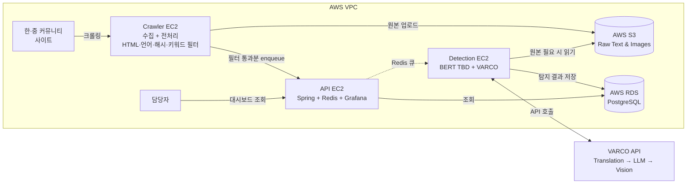
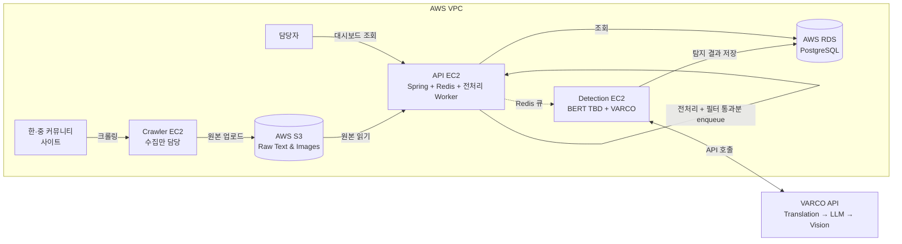
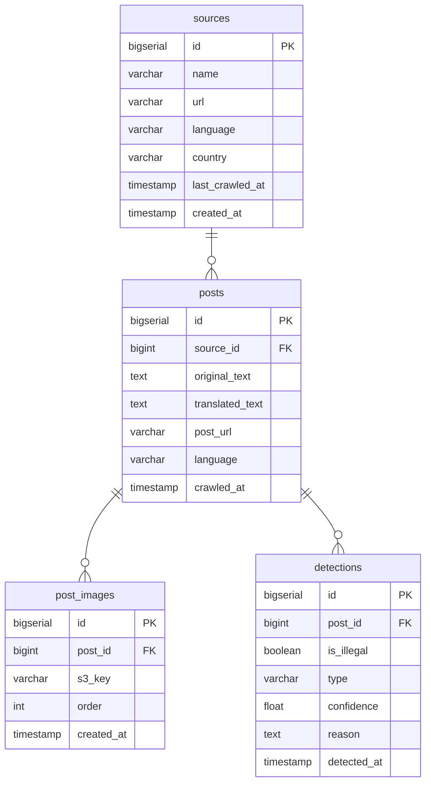
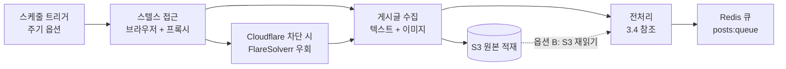
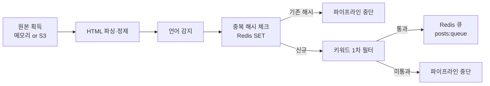
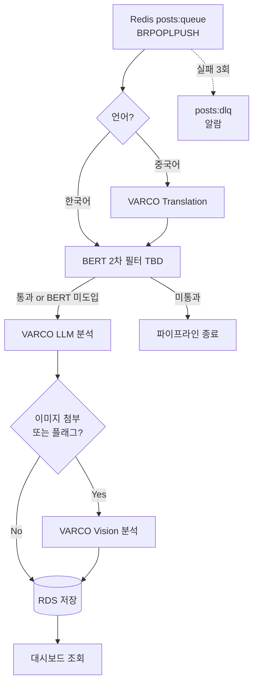

# Tracker — 게임 불법 프로그램 유포 자동 탐지 시스템

> **과목:** 고려대학교 실전SW프로젝트
> **협력 기업:** NC AI
> **팀:** Tracker
> **제출일:** 2026년 4월
> **작업 기간:** 11주

---

## 📋 목차

1. [프로젝트 개요](#1-프로젝트-개요)
2. [시스템 아키텍처](#2-시스템-아키텍처)
3. [크롤링 시스템](#3-크롤링-시스템)
4. [AI 탐지 시스템 (VARCO 파이프라인)](#4-ai-탐지-시스템-varco-파이프라인)
5. [서비스 기능 및 화면](#5-서비스-기능-및-화면)
6. [소프트웨어 스택](#6-소프트웨어-스택)
7. [프로젝트 수행 계획](#7-프로젝트-수행-계획)
8. [기대효과 및 확장성](#8-기대효과-및-확장성)
9. [윤리적 고려사항](#9-윤리적-고려사항)
10. [문서 내 표기 불일치 항목](#10-문서-내-표기-불일치-항목)

---

## 1. 프로젝트 개요

### 1.1 프로젝트 소개

본 프로젝트는 게임 불법 프로그램(매크로, 핵, 리세마라 계정 거래 등)의 유포·판매 게시글을 자동으로 탐지하는 시스템을 설계하고 구현한다. 한국·중국 주요 커뮤니티 사이트를 자동 크롤링하고, NC AI의 VARCO Translation·LLM·Vision API를 파이프라인으로 조합하여 다국어 불법 게시글을 자동 탐지·분류·기록한다. 탐지 결과는 구성된 대시보드를 통해 담당자가 실시간으로 확인할 수 있다.

### 1.2 배경 및 문제 정의

| 구분 | 내용 |
|------|------|
| **현황 (As-Is)** | 게임 치트 경제 규모 85억 달러(약 11조 원) 추산(Intorqa, 2026). PC 게이머의 80%가 치터를 만난 경험, 52%는 매달 경험(PlaySafe ID, 2025). 국내외 전문 매크로·핵 판매 커뮤니티가 공개 운영되고 있으며, 기존 anti-piracy 솔루션(MUSO, Irdeto 등)은 영상·음악 저작권 침해에 특화되어 있으나 게임 불법 프로그램 유포 탐지 영역은 미비하다고 판단했다. |
| **Pain Point** | 수동 모니터링 한계(한·중 커뮤니티 실시간 대응 불가) / 다국어 장벽(중국어 번역 없이 탐지 불가) / 텍스트 우회 전략(이미지로 올려 탐지 회피) / 판단 근거 부재(불법 여부만 판단, 기록·보고 불가) |
| **해결 방향 (To-Be)** | 웹 크롤러가 한·중 주요 사이트를 자동 수집하고, VARCO Translation → LLM → Vision 파이프라인으로 다국어 불법 게시글을 자동 탐지·분류·기록하는 시스템 구축 |

### 1.3 프로젝트 목표 및 MVP

| 항목 | 정의 | 성공 기준 (KPI) |
|------|------|------------------|
| **MVP** | 크롤링 → 전처리(언어 감지·중복 제거·키워드 필터) → VARCO Translation → VARCO LLM 분류 → RDS 저장 → 대시보드 표시까지의 End-to-End 파이프라인이 자동으로 동작하는 데모 | 탐지 정확도 F1 ≥ 0.80 / **[옵션 선택 필요]** 자동 크롤링 주기 (15분 / 1시간 / 하루 2~4회 중 택일) / 1회 배치 ≤ 30분 / 대시보드 5분 이내 반영 / **최대 8개 대상 사이트(한국 5 + 중국 3) 중 MVP는 연결 성공 확인된 사이트만 운영** |

> 📌 **주기 옵션 비교** (팀 결정 사항)
> | 주기 | 일일 실행 횟수 | 프록시/VARCO 비용 영향 | 대응 지연 |
> |------|--------------|---------------------|---------|
> | 15분 | 96회 | 기존 대비 ~48배 | 최대 15분 |
> | 1시간 | 24회 | 기존 대비 ~12배 | 최대 1시간 |
> | 하루 2~4회 | 2~4회 | 기존 설정 | 최대 6~12시간 |
>

### 1.4 서비스 시나리오

**페르소나:** NC AI 게임 보안 담당자

| 단계 | 사용자 행동 | 시스템 응답 |
|------|-------------|-------------|
| ① | 대시보드 접속 | 오늘 탐지 수, 사이트별·유형별 분포 차트 표시 |
| ② | 탐지 게시글 클릭 | 원문 텍스트, 번역 텍스트, VARCO 판단 근거, 신뢰도 점수 표시 |
| ③ | 출처 URL 클릭 | 원본 게시글 페이지로 이동하여 직접 조치 가능 |
| ④ | 수동 크롤링 요청 | `POST /crawl/trigger` 호출 → 즉시 크롤링 실행 후 결과 반영 |

---

## 2. 시스템 아키텍처

### 2.1 AWS 인프라 구성

시스템은 크롤러 워커 / 탐지 모델 / API 서버 역할로 EC2 3대를 분리하여 독립적으로 스케일링할 수 있도록 설계한다. S3는 원시 데이터 공유 스토리지, RDS는 탐지 결과 관계형 저장소, **Redis(API EC2 공존)**는 메시지 큐 + 캐시 + VARCO rate limit 역할을 담당한다. 외부 VARCO API는 탐지 모델 EC2에서 호출한다.

> 🛠 **인프라 관리 — 2026-05-06 ClickOps PIVOT.** 본래 Terraform IaC로 일원화하기로 결정했으나(`infra/terraform/` 코드 + 공식 모듈 + GitHub OIDC + CI 게이트), 학생 IAM 사용자(`<student-iam-user>`)에서 (1) IAM Access Key 발급 차단 (2) CloudShell `cloudshell:CreateEnvironment` deny (3) IAM Role 생성 차단 — Terraform이 AWS API 호출할 자격증명 통로 0개로 apply 불가능. Terraform 자산 일괄 제거(commit `13d96a9`) 후 **콘솔 ClickOps + 스크린샷**으로 전환. 인프라 사양(EC2/RDS/SG/IAM 권한 패턴, 학생 계정 PIVOT으로 t3.medium x86_64 ×3 / db.t3.micro publicly_accessible=true 등)은 그대로 콘솔에 적용. 상세는 `_bmad-output/planning-artifacts/architecture.md` Infrastructure & Deployment 섹션 + Story 5.3 (`epics.md`) + Story 5.3 결과 문서(`_bmad-output/implementation-artifacts/5-3-aws-프로덕션-인프라-프로비저닝.md`) 참조. **졸업 후 개인 AWS 계정에서는 git history(`b7e24d3`, `bd172d9`)의 Terraform 코드로 동일 인프라 1회 apply 재현 가능.**

#### 2.1.1 공통 구성 요소

| 서버 / 리소스 | 역할 | 주요 구성 요소 |
|------|------|----------------|
| **크롤러 워커 EC2** | 한·중 사이트 자동 수집 (+ 옵션 A 시 전처리 인라인 수행) | Crawl4AI (Playwright 기반), FlareSolverr, APScheduler, S3 업로더, (옵션 A 시 전처리 모듈: BeautifulSoup/lxml, langdetect, 키워드 필터) |
| **탐지 모델 EC2** | AI 탐지 파이프라인 실행 | **BERT [TBD]**, VARCO Translation API, VARCO LLM API, VARCO Vision API, RDS 저장 |
| **API 서버 EC2** | REST API · 대시보드 · Redis 호스팅 (+ 옵션 B 시 전처리 Worker 구동) | Java Spring, **Redis (docker-compose 공존)**, Prometheus, Grafana, (옵션 B 시 전처리 Worker 프로세스) |
| **AWS S3** | 원시 데이터 저장 | 크롤링 텍스트 + 이미지 원시 데이터 적재. EC2 간 데이터 공유, 재처리용 아카이브. **VPC Gateway Endpoint를 통해 NAT 통과 없이 접근하여 데이터 전송 비용 절감** |
| **AWS RDS (PostgreSQL 18.3)** | 탐지 결과 저장 | sources / posts / post_images / detections 4개 테이블. 관계형 구조로 참조 무결성 보장. **db.t4g.micro Single-AZ + 7일 automated backup**로 비용 최소화. 학생 계정 강제로 publicly_accessible=true이지만 SG inbound source 한정 + parameter group `rds.force_ssl=1`로 인터넷 접속 차단. **2026-05-11 사용자 콘솔 launch 확인**: 학생 SCP가 RDS 엔진 16/17 노출 안 해 PG 18.3-R1만 가용 (4차 PIVOT). RDS Graviton(arm64) db.t4g.micro는 EC2 SCP와 별개로 학생 계정에서 가용 — 이전 "db.t4g.micro arm64 미가용" 기록은 1차 PIVOT 시 잘못된 가정. 8.3절 Class-RAG(pgvector) 확장은 PG 18에서도 지원 |
| **Redis (API EC2 내 공존)** | MQ + 캐시 + rate limit | `posts:queue` (main), `posts:processing` (in-flight), `posts:dlq` (실패), `posts:dedup` (해시 SET), `varco:rate_limit` (토큰 버킷), 세션/대시보드 캐시 |

#### 2.1.1.a 인스턴스 사이징 (학생 계정 PIVOT 적용)

학생 계정 SCP가 EC2 인스턴스 타입을 `t3.{nano,micro,small,medium}` 4종으로 한정 + Graviton(arm64) 시리즈 미가용 → **production 사양(Crawler r6g.large 16GB / Detection t4g.medium / API t4g.large) → 모두 t3.medium x86_64 4GB로 강제 다운그레이드**.

| 서버 / 리소스 | 인스턴스 타입 | vCPU | RAM | 선정 근거 |
|------|------|------|-----|------|
| **Crawler EC2** | **t3.medium** (x86_64) | 2 | 4GB | 학생 계정 4종 한정 + Graviton 미가용 → 최대 사양 t3.medium 강제. 본래 RAM 우선 정책(16GB 권장)과 12GB 갭 — Crawl4AI(Playwright Chromium 200MB/instance) + FlareSolverr + 전처리가 4GB에 모두 적재되므로 Story 5.4 부하 측정 후 ① 사이트 분리 ② swap 4GB ③ `--single-process` ④ 동시 worker 1 강제 중 택1 (deferred-work) |
| **Detection EC2** | **t3.medium** (x86_64) | 2 | 4GB | 학생 계정 강제. VARCO API 호출 위주(외부 LLM)라 자체 연산 부담은 작아 다운그레이드 영향 작음. BERT 도입(10.1) 시 학생 계정에선 c5/c6 시리즈 불가능하므로 도입 보류 |
| **API EC2** | **t3.medium** (x86_64) | 2 | 4GB | 학생 계정 강제. Java Spring(JVM heap ~500MB) + Redis docker-compose + Prometheus + Grafana + Nginx + 전처리 Worker(옵션 B)가 4GB에 동거 → OOM risk 큼. JVM heap 조정 + Prometheus retention 단축 또는 Story 5.4 측정 후 컴포넌트 일부 분리 |
| **AWS RDS** | **db.t4g.micro Single-AZ** (PostgreSQL 18.3 arm64) | 2 | 1GB | 2026-05-11 사용자 콘솔 launch 확인 — RDS Graviton(arm64)은 EC2 SCP와 별개로 학생 계정 가용. MVP 트래픽(수천~수만 게시글) + 4테이블 단순 스키마 + 인덱스(2.3절) 처리 가능. Multi-AZ는 샌드박스 템플릿 강제로 자동 비활성. publicly_accessible=true 강제 → SG inbound 5432 source 한정 + `rds.force_ssl=1` 보강 |
| 비용 | — | — | — | 학교 사전 설정 budget 한도 활용 (Cost Explorer 사후 모니터링). 30만원 자체 Budget 자원은 학생 계정 권한 부족으로 미생성 |

> 📌 **운영 모델 — 콘솔 ClickOps** (2026-05-06 PIVOT). 학생 IAM 자격증명 통로 0개(IAM Access Key + CloudShell + IAM Role 생성 모두 차단)로 Terraform IaC 폐기 후 콘솔 수동 생성으로 전환. 1차 IaC 코드(production 사양 r6g.large 등)는 git history(`b7e24d3`, `bd172d9`)에 보존되어 졸업 후 개인 계정에서 1회 apply 재현 가능. 자세한 사유는 Story 5.3 결과 문서 참조.
>
> 📌 **EC2 IAM Role**: 학생 본인이 신규 Role 생성 불가 → 학교 사전 생성 Role(예: `LabRole`)을 EC2에 attach. 그 Role의 정책에 `AmazonSSMManagedInstanceCore` + Secrets Manager `GetSecretValue` + S3 PutObject 권한이 있는지가 SSM 접속 + 시크릿/S3 사용 가능 범위를 결정 — Story 5.3 ClickOps 진행 시 1회 검증 필요.
>
> 📌 **Crawl4AI 운영 표준** (3.3 파이프라인 적용): Docker 실행 시 `--shm-size=2g` 강제(Chromium IPC SHM 부족 → SIGBUS 크래시 방지), `max_session_permit` 학생 사양(4GB)에서는 보수적으로 2~3 정도, MemoryAdaptiveDispatcher 활성으로 메모리 압박 시 동시성 자동 감소.

#### 2.1.2 아키텍처 옵션 (전처리 위치) — 팀 결정 필요

| 구분 | **옵션 A** | **옵션 B** |
|------|-----------|-----------|
| **전처리 위치** (HTML 파싱·정제, 언어 감지, 중복 해시, 키워드 1차 필터) | Crawler EC2 인라인 | API EC2의 별도 Worker 프로세스 |
| **BERT [TBD] + VARCO 호출** | Detection EC2 | Detection EC2 |
| **S3 원본 접근** | 크롤러 메모리 → 그대로 전처리 (재읽기 없음) | Crawler가 S3 업로드 → API Worker가 S3 재읽기 |
| **Redis enqueue 주체** | Crawler EC2 | API EC2 Worker |
| **장점** | S3 재읽기 불필요 / 필터 통과분만 큐 적재 → 큐 부하 최소화 / Detection EC2가 AI 전담 | Crawler는 수집만 담당 → 역할 단순 / 전처리 확장이 크롤러와 독립 |
| **단점** | Crawler EC2가 수집 + 전처리 이중 역할 | API EC2에 Spring + Redis + Worker 3역할 집중 → SPOF 위험 / S3 재읽기 I/O 비용 |
| **스케일링 경로** | 크롤러 확장 시 전처리도 함께 확장 (규모 구간에선 OK) | 전처리만 독립 수평 확장 가능 |

> 📌 **옵션 A/B는 팀 논의 후 확정한다.** 선택에 따라 3.3 크롤링 파이프라인·3.4 전처리 파이프라인의 실행 위치가 확정된다. Redis가 API EC2에 공존하는 점은 두 옵션 공통이다.

### 2.2 아키텍처 다이어그램

#### 2.2.1 옵션 A — 전처리를 Crawler EC2 인라인 수행

#### 2.2.2 옵션 B — 전처리를 API EC2의 별도 Worker에서 수행

### 2.3 DB 스키마 (RDS)

| 테이블 | 주요 컬럼 | 용도 |
|--------|-----------|------|
| **sources** | `id`, `name`, `url`, `language`, `country`, `last_crawled_at`, `created_at` | 크롤링 대상 사이트 목록 관리 |
| **posts** | `id`, `source_id`, `original_text`, `translated_text`, `post_url`, `language`, `crawled_at` | 수집된 게시글 원문·번역문 저장 |
| **detections** | `id`, `post_id`, `is_illegal`, `type`, `confidence`, `reason`, `detected_at` | 탐지 결과 (불법 여부·유형·신뢰도·근거) 저장 |
| **post_images** | `id`, `post_id`, `s3_key`, `order`, `created_at` | 게시글별 수집 이미지 S3 경로 저장 (VARCO Vision 탐지용) |

#### ERD 다이어그램

---

## 3. 크롤링 시스템

### 3.1 크롤링 대상 사이트

| 국가 | 사이트 URL | 유형 | 주요 콘텐츠 |
|------|------------|------|-------------|
| 한국 | `tailstar.net` | 매크로 커뮤니티/판매 | 리니지 등 MMORPG 매크로 전문 판매 |
| 한국 | `cheatdot.com` | 핵/치트 포럼 | FPS·배틀로얄 핵 프로그램 공유 |
| 한국 | `mart-hack.com` | FPS 핵 판매 | FPS 게임 에임봇·ESP 핵 판매 |
| 한국 | `enjoymacro.com` | 리니지 매크로 전문 | 리니지 시리즈 자동사냥 매크로 |
| 한국 | `barotem.com` | 계정/아이템 거래 | 고레벨 계정·리세마라 계정 판매 |
| 중국 | `tieba.baidu.com` | 바이두 포럼 | 불법 프로그램 홍보 채널 |
| 중국 | `52pojie.cn` | 크랙/핵 전문 포럼 | 게임 핵/치트/패치 툴 공유 및 배포 |
| 중국 | `bbs.nga.cn` | 대형 게임 커뮤니티 | 게임 전반 커뮤니티 |

> 📌 **MVP 운영 범위**: 위 8개 사이트를 최대 대상으로 하되, **MVP에서는 크롤러 연결 성공·기본 수집 안정성이 확인된 사이트만 운영**한다. 차단·구조 변경 등으로 수집이 불가한 사이트는 대안 사이트로 교체 또는 확장 단계로 이월한다. 중국 사이트는 프록시 품질과 GFW·Cloudflare 대응 결과에 따라 실제 가용 수가 달라질 수 있다.

### 3.2 크롤링 기술 스택

> 📌 **팀 결정 필요**: 아래 카테고리별 옵션 중 최종 채택안을 확정한다. 프록시 프로바이더는 인터페이스 추상화(`ProxyProvider`)로 구현해 교체 비용을 최소화한다.

#### 3.2.1 브라우저 스텔스 (택 1)

| 옵션 | 장점 | 단점 | 월 비용 (도구 자체) | 비고 |
|------|------|------|------------------|------|
| **Nodriver** | undetected-chromedriver 후계작, 스텔스 성능 강함, WebDriver 없이 동작 | 유지보수가 소수 개발자 의존 → 장기 리스크 | $0 (오픈소스) | 기획서 초기 선정안 |
| **Playwright + stealth plugin** | 활발한 생태계, async 지원, 디버깅·문서 풍부, 팀 학습 용이 | Nodriver 대비 탐지율 약간 높음 (사이트별 편차) | $0 (오픈소스) | 팀 프로젝트 유지보수성 ↑ |

#### 3.2.2 Cloudflare 우회

| 옵션 | 장점 | 단점 | 비고 |
|------|------|------|------|
| **FlareSolverr** | Docker 기반, Cloudflare JS 챌린지 자동 해결, Selenium 대비 경량 | 단독 사용 불가(브라우저와 쌍), 컨테이너 상주 필요 | 기획서 초기 선정안 |

#### 3.2.3 프록시 (택 1 또는 다중, 용도별)

기준: 대상 사이트 = 한국 5 + 중국 3, 주기 = 1시간 또는 15분 (1.3 참조), 월 트래픽 추정.

| 옵션 | 유형 | 장점 | 단점 | 월 예상 비용 | 비고 |
|------|------|------|------|------------|------|
| **ThorData** | Residential 종량제 | 6,000만+ IP 풀, 중국 사이트 차단 우회 최상, 게임 산업에서 실제 사용 사례 다수 | 고비용 (GB 단가 높음) | ~$60~120 | 기획서 초기 선정안 |
| **IPRoyal ISP Proxies** | ISP 프록시 | 차단율 낮고 가격 합리적, 종량제·정액제 선택 가능 | 중국 IP 풀은 ThorData 대비 얕음 | ~$40~80 | 비용 절감 1순위 대안 |
| **Smartproxy ISP** | ISP 프록시 | 안정성 상위, 교육·학생 할인 프로그램 존재 | 국내 지원 채널 제한적 | ~$40~80 | 학생 프로그램 문의 시 유리 |
| **Oxylabs DC Proxies** | Datacenter 프록시 | 최저가, 응답 속도 빠름 | 차단율 높음(~40%), 중국 사이트엔 부적합 | ~$10~30 | 개발·테스트 환경용 |
| **무료 프록시 풀** (proxy-pool 등) | 수집형 오픈소스 | 무료 | 매우 불안정, 실 서비스 운용 불가, 검증 오버헤드 | $0 | MVP 초기 데모·PoC 한정 |
| **자체 프록시 (VPS 회전)** | 자체 구축 | 완전 통제 가능, 장기 트래픽에 고정비 유리 | 운영 부담 큼, 중국 IP 확보 어려움 | VPS 3~5대 $15~40 | 백업 플랜 |
| **Tor** ⚠️ 비권장 | 익명 네트워크 | 비용 0, 익명성 | **중국 사이트 거의 100% 차단** (Cloudflare·GFW·Exit 노드 공개 블록) · 속도 3~10초 · 대상 사이트 ToS 위반 소지 · 중간발표/심사 방어 어려움 | $0 | **채택 비권장** (검토 기록용으로만 기재) |

> 📌 **권장 조합 (팀 참고)**: (1) 개발·PoC 단계 = 무료 프록시 풀 또는 Oxylabs DC / (2) 중간발표·본 운영 = IPRoyal ISP 또는 Smartproxy ISP / (3) 최종 확장 = ThorData 복귀 또는 유지. 단, 최종 선택은 중국 사이트 실제 차단율 테스트 후 확정.

#### 3.2.4 스케줄링

| 옵션 | 장점 | 단점 | 비고 |
|------|------|------|------|
| **APScheduler** | Python 네이티브, 경량, cron·interval·date 트리거 모두 지원, 단일 프로세스 내장 | 단일 프로세스 기반 (분산 스케줄링엔 한계) | 기획서 초기 선정안 |

### 3.3 크롤링 파이프라인

> 📌 본 섹션은 수집~S3 적재~Redis enqueue까지 공통 흐름을 정의한다. 전처리(HTML 파싱·언어 감지·중복 해시·키워드 필터)의 구체 단계는 **3.4 전처리 파이프라인**에 분리 기술했으며, 실행 위치(옵션 A = Crawler 인라인 / 옵션 B = API EC2 Worker)는 아키텍처 옵션(2.1.2) 결정에 따른다.

| 순서 | 처리 | 상세 | 실행 위치 (옵션 A) | 실행 위치 (옵션 B) |
|------|------|------|------------------|------------------|
| 1 | 스케줄 트리거 | APScheduler가 **[주기 옵션 — 1.3 참조]** 또는 수동 트리거로 크롤링 시작 | Crawler | Crawler |
| 2 | 스텔스 접근 | **[선택된 스텔스 브라우저 — 3.2.1]** + **[선택된 프록시 — 3.2.3]** 조합으로 bot 탐지 회피. Cloudflare 차단 시 FlareSolverr 우회 | Crawler | Crawler |
| 3 | 게시글 수집 | 텍스트 + 이미지 URL 수집. 이미지는 별도 다운로드 | Crawler | Crawler |
| 4 | 원본 S3 적재 | 수집 데이터(텍스트+이미지)를 S3에 원본 저장 (아카이브·재처리 겸용) | Crawler | Crawler |
| 5 | **전처리 (→ 3.4 참조)** | HTML 파싱 → 언어 감지 → 중복 해시 → 키워드 1차 필터 | **Crawler 메모리 내 인라인** | **API EC2 Worker가 S3 재읽기 후 수행** |
| 6 | Redis enqueue | 필터 통과 메시지만 `posts:queue`에 LPUSH (payload: `{post_id, s3_key, site, lang, title_hash}`) | Crawler | API EC2 Worker |

### 3.4 전처리 파이프라인

> 📌 **실행 위치**: 옵션 A 적용 시 Crawler EC2 메모리 내 인라인 실행 · 옵션 B 적용 시 API EC2의 별도 Worker 프로세스가 S3 원본을 재읽기 후 실행. 두 옵션 공통으로 Redis를 메타 저장소(중복 해시 SET)로 활용한다.

| 순서 | 처리 | 상세 | 도구 / 방식 |
|------|------|------|------------|
| 1 | HTML 파싱·정제 | DOM 불필요 태그·광고·네비 제거 후 본문·제목·이미지 URL 추출 | BeautifulSoup / lxml |
| 2 | 언어 감지 | 한국어/중국어 판별. 이후 VARCO Translation 경유 여부 결정 | langdetect / fasttext-langid |
| 3 | 중복 해시 체크 | `sha256(post_url + title + author)` 산출 → `SADD posts:dedup <hash>`의 반환값으로 신규 여부 판정. 기존 값이면 파이프라인 중단 (VARCO 호출 비용 절감의 핵심) | Redis SET |
| 4 | 키워드 1차 필터 | 한국어·중국어 키워드 사전(매크로·핵·치트·外挂·破解·解锁 등) 정규식 매칭. 통과분만 다음 단계로 | Python 정규식 + 키워드 사전 |
| 5 | Redis enqueue | 필터 통과 메시지를 `posts:queue`로 LPUSH | Redis LIST |

> 📌 **비용 절감 레버**: 3단계(중복 해시)와 4단계(키워드 필터)가 VARCO API 호출량을 가장 크게 줄이는 구간이다. 키워드 통과율은 체감 경험상 ~10% 수준으로 기대하며, 실 운영 시 측정 후 키워드 사전을 주기적으로 업데이트한다.

---

## 4. AI 탐지 시스템 (VARCO 파이프라인)

### 4.1 VARCO API 활용 구성

| VARCO API | 역할 | 선택 근거 및 특징 |
|-----------|------|-------------------|
| **VARCO LLM** | 불법 판단 + 유형 분류 + 근거 생성 | NC AI 자체 한국어 특화 LLM. GPT-3.5-Turbo 수준 성능(MT-Bench 기준). 게임 도메인 이해도 강점. 탐지 결과를 JSON 형식으로 구조화 출력. |
| **VARCO Translation** | 중국어→한국어 번역 | NC AI 게임 채팅 번역 엔진 기반. 게임 도메인 용어 일관성 처리 강점. 번역 후 VARCO LLM에 투입하여 다국어 탐지 정확도 향상. |
| **VARCO Vision** | 이미지+텍스트 동시 분석 | VARCO-VISION 2.0 14B. 한국어 이미지 이해 벤치마크에서 InternVL3-14B, Ovis2-16B 능가. 이미지로 올라온 불법 게시글(텍스트 우회) 탐지에 활용. |

### 4.2 탐지 파이프라인

> 📌 본 파이프라인은 **전처리(3.4)에서 키워드 필터를 통과하여 Redis 큐에 적재된 메시지**를 대상으로 한다. 전처리 단계는 본 파이프라인에서 제외되며, Detection EC2는 AI 호출 전담이다.

| 단계 | 처리 | 상세 |
|------|------|------|
| 1 | **Redis 큐 dequeue** | `BRPOPLPUSH posts:queue → posts:processing`로 원자적 이동. Worker 크래시 시 Watchdog가 `posts:processing`의 오래된 메시지를 `posts:queue`로 재큐잉 |
| 2 | **VARCO Translation** | 언어 감지 결과가 중국어인 메시지 대상. 한국어로 번역 후 다음 단계 투입. 게임 도메인 용어 일관성 보장. (한국어는 스킵) |
| 3 | **BERT 2차 필터 [TBD]** | 번역된/원문 한국어 게시글로 불법 프로그램 판매·계정 거래·정상 등 범주별 위험도 점수 산정 → 임계값 통과 게시글만 VARCO LLM 호출 대상으로 선별. **BERT 도입 여부 및 모델은 팀 결정 필요 — 미도입 시 본 단계는 생략되고 키워드 필터(전처리)만으로 LLM 대상 선정** |
| 4 | **VARCO LLM** | 불법 여부 판단 + 유형 분류 + 근거 생성. 출력 형식: `{ "is_illegal": true, "type": "매크로 판매", "confidence": 0.92, "reason": "판단근거" }` |
| 5 | **VARCO Vision (조건부)** | 이미지 첨부 게시글 또는 BERT [TBD] 점수 기준 통과 게시글 대상. S3에서 이미지 읽어 Vision API에 전달. 이미지 속 텍스트 인식 + 불법 내용 판단 (텍스트 우회 대응) |
| 6 | **VARCO Rate Limit 제어** | Worker별 호출 전 Redis 토큰 버킷(`varco:rate_limit`) 체크. 초과 시 대기 후 재시도 — 다중 Worker에서도 VARCO API 할당량 보호 |
| 7 | **RDS 저장** | 탐지 결과 JSON → `detections` 테이블 저장. 대시보드 실시간 조회 가능 |
| 8 | **메시지 제거 / DLQ** | 성공 시 `LREM posts:processing`. 실패 3회 반복 시 `posts:dlq`로 격리, CloudWatch/Grafana 알람 |

---

## 5. 서비스 기능 및 화면

### 5.1 핵심 기능 목록

| 기능명 | 설명 | 우선순위 | 담당 |
|--------|------|----------|------|
| 다국어 자동 수집 | 최대 8개 대상(한국 5 + 중국 3) 중 연결 성공 확인된 사이트 자동 크롤링 | [Must] | 크롤링 |
| 이미지 수집 | 게시글 내 이미지를 S3에 함께 저장 (Vision 탐지용) | [Must] | 크롤링 |
| 주기 스케줄링 **[옵션 선택 필요]** | APScheduler로 **[15분 / 1시간 / 하루 2~4회 — 택일]** 자동 실행 | [Must] | 크롤링 |
| HTML 전처리·정제 | 태그 제거·본문 추출·이미지 URL 분리 | [Must] | 크롤링 or 백엔드 (옵션 A/B) |
| 중복 해시 체크 | Redis SET 기반 신규 게시글 식별 → VARCO 호출 비용 절감 | [Must] | 크롤링 or 백엔드 (옵션 A/B) |
| 키워드 1차 필터 | 한·중 키워드 정규식으로 후보 추출 | [Must] | 크롤링 or 백엔드 (옵션 A/B) |
| Redis 메시지 큐 | `posts:queue` + `posts:processing` + `posts:dlq` 관리, 재시도·Watchdog | [Must] | 백엔드 |
| **BERT 2차 필터 [TBD]** | 번역 후 위험도 점수 산정하여 VARCO LLM 대상 선별 — **도입 여부·모델 팀 결정 필요** | [TBD] | AI·탐지 |
| VARCO Translation | 중국어 게시글을 한국어로 번역 | [Must] | AI·탐지 |
| VARCO LLM 분류 | 불법 여부·유형·판단 근거 JSON 생성 | [Must] | AI·탐지 |
| VARCO Vision 탐지 | 이미지 첨부 게시글 분석 (텍스트 우회 대응) | [Must] | AI·탐지 |
| VARCO Rate Limit 제어 | Redis 토큰 버킷으로 다중 Worker API 할당량 보호 | [Must] | 백엔드 |
| 탐지 목록 조회 | `GET /detections` (필터: 날짜·유형·언어·사이트) | [Must] | 백엔드 |
| 통계 조회 | `GET /stats` — 총 탐지 수, 유형별·사이트별 분포 | [Must] | 백엔드 |
| 대시보드 | 실시간 탐지 현황, 분포 차트, 게시글 목록 조회 | [Must] | 프론트엔드 |
| 수동 크롤링 트리거 | `POST /crawl/trigger` — 즉시 크롤링 실행 (관리자용) | [Nice] | 백엔드 |

### 5.2 유스케이스

1. 담당자는 대시보드에서 오늘 탐지된 게시글 수와 유형별 비율을 한눈에 확인한다.
2. 담당자는 날짜·사이트·유형·언어 필터를 조합하여 원하는 탐지 결과 목록을 조회한다.
3. 담당자는 특정 탐지 게시글을 클릭하여 원문·번역문·판단 근거·신뢰도를 상세 확인한다.
4. 담당자는 출처 URL을 통해 원본 게시글 페이지로 이동하여 조치를 취한다.
5. 담당자는 특정 사이트에 대해 수동 크롤링을 즉시 실행하여 최신 게시글을 수집한다.
6. 시스템은 하루 2~4회 자동으로 지정 사이트를 크롤링하고 탐지 결과를 저장한다.
7. 시스템은 외국어(중국어) 게시글을 자동 감지하여 VARCO Translation으로 번역 후 탐지에 투입한다.
8. 시스템은 이미지로만 구성된 게시글을 VARCO Vision으로 분석하여 텍스트 우회 탐지를 수행한다.

### 5.3 화면 흐름 (Dashboard Flow)

| 화면 | 주요 구성 요소 |
|------|----------------|
| **메인 대시보드** | 오늘 탐지 수 / 전일 대비 증감 / 유형별 파이 차트 / 사이트별 바 차트 |
| **탐지 목록** | 날짜·사이트·유형·언어 필터 / 탐지 게시글 테이블 (신뢰도·유형·출처 표시) |
| **탐지 상세** | 원문 텍스트 / 번역 텍스트 / 판단 근거 / 신뢰도 점수 / 출처 URL 링크 |
| **통계 화면** | 주간·월간 탐지 추이 차트 / 사이트별 비교 / 언어별 분포 |

---

## 6. 소프트웨어 스택

| 레이어 | 기술 / 도구 | 용도 |
|--------|-------------|------|
| 언어 / 런타임 | Python, Java | 크롤링·AI-Python, 서버-Java |
| 크롤링 브라우저 **[옵션]** | Nodriver **또는** Playwright + stealth — 3.2.1 참조 | 스텔스 크롤링 |
| Cloudflare 우회 | FlareSolverr | JS 챌린지 자동 해결 |
| 프록시 **[옵션]** | ThorData / IPRoyal ISP / Smartproxy ISP / Oxylabs DC / 무료 풀 / 자체 VPS — 3.2.3 참조 (Tor 비권장) | IP 회전·지역 차단 우회 |
| 스케줄링 | APScheduler | 주기(1.3 선택) 자동 크롤링 스케줄 관리 |
| 전처리 | BeautifulSoup/lxml, langdetect, 정규식 키워드 사전 | HTML 파싱·언어 감지·키워드 필터 |
| 메시지 큐 + 캐시 | **Redis** (API EC2 docker-compose 공존) | `posts:queue`/`processing`/`dlq`/`dedup`, VARCO rate limit, 세션/대시보드 캐시 |
| AI (VARCO) | **BERT [TBD]**, VARCO LLM, Translation, Vision | 2차 필터(미정) + 다국어 번역 + 불법 분류 + 이미지 탐지 |
| 클라우드 | AWS **단일 EC2 t3.xlarge x86_64 16GB** (3차 PIVOT 회귀), S3 (VPC Gateway Endpoint 미생성 — IGW 경유), RDS **PostgreSQL 18.3 db.t4g.micro arm64 Single-AZ**, publicly_accessible=true + SG/force_ssl 보강 | 4개 서비스 + Redis 단일 호스트 docker compose 공존 + 데이터 저장. EC2 SCP는 Graviton 차단되나 RDS Graviton은 가용. 인스턴스 사이징 근거는 2.1.1.a 참조 |
| 인프라 관리 | **콘솔 ClickOps** (2026-05-06 PIVOT) | 본래 Terraform IaC 채택. 학생 IAM 자격증명 통로 0개(IAM Access Key 차단 + CloudShell deny + IAM Role 생성 deny)로 apply 불가능 → ClickOps 전환. Terraform 코드는 git history(`b7e24d3`, `bd172d9`) 보존, 졸업 후 개인 계정에서 1회 apply 재현 가능. 자세한 사유는 본 문서 2.1 인프라 박스 + Story 5.3 PIVOT 참조 |
| EC2 접근·운영 | **AWS SSM Session Manager** (SSH 키 미사용) | EC2에 IAM Instance Role + SSM agent(Amazon Linux 2023 기본 포함). 외부 22번 포트 차단(NFR7), SSH 키 분배·회수 운영 부담 0, 세션 로그 자동 기록(NFR9 충족) |
| 보안 baseline | S3 퍼블릭 차단 (콘솔에서 4종 활성) + RDS `rds.force_ssl=1` + 보안 그룹 inbound 최소화 + SSE-S3(AES256) 자동 암호화 | EBS encryption by default / VPC Flow Logs / CloudTrail / KMS CMK / AWS Budgets / AWS Config / SecurityHub / GuardDuty 모두 학생 계정 권한 부족으로 미생성 — 학교 organization trail + region default 정책 의존 (활성 여부는 학교 측 별도 확인 필요). 발견 시 콘솔 1회 enable로 보강 |
| API 서버 | Java Spring | REST API, 자동 Swagger 문서화 |
| 대시보드 | React | 탐지 현황·차트·게시글 목록 시각화 |
| 모니터링 | Prometheus + Grafana, CloudWatch | API 응답 시간·에러율·큐 길이·DLQ 알람 |
| CI/CD | GitHub Actions | 코드 푸시시 자동 빌드·배포 |
| 개발방법론 | BMAD Method v6 | AI 에이전트 기반 Agile 개발. PM→Architect→Dev→QA 에이전트 협력 |

---

## 7. 프로젝트 수행 계획 (11주)

### 7.1 주차별 마일스톤

| 주차 | 단계 | 주요 과업 및 산출물 |
|------|------|---------------------|
| **1~2주** | 기획 및 설계 | 기획서 확정(아키텍처 옵션 A/B·주기·크롤링 도구·BERT 도입 확정), AWS 인프라 셋업(EC2·RDS·S3·Redis), VARCO API 키 발급·연동 테스트, BMAD PRD 작성 |
| **3~5주** | 크롤링 개발 **[중간발표]** | 선택된 [크롤링 브라우저·프록시] 기반 크롤러 구현, APScheduler 스케줄링, 이미지 수집, S3 적재, 전처리(HTML·언어·해시·키워드), Redis 큐 연동, VARCO Translation 연동 |
| **6~9주** | 탐지 파이프라인 및 서비스 | VARCO LLM·Vision 탐지 모듈 구현, BERT [TBD] 2차 필터(도입 결정 시), RDS 저장, Java Spring REST API, 대시보드, 수동 라벨링 데이터셋 구축 |
| **10~11주** | QA 및 최종 발표 **[최종발표]** | F1 Score 측정 보고서 작성, 버그 수정·최적화, 시연 영상 제작, 최종 발표 준비 |

### 7.2 역할 분담

| 역할 | 담당자 | 주요 담당 업무 |
|------|--------|----------------|
| **PM / 기획** | 다같이 | 기획서 관리, NC AI 멘토 소통, 일정 조율, BMAD PM 에이전트 운용 |
| **크롤링 담당** | 일드매 | [선택된 스텔스 브라우저]·FlareSolverr·[선택된 프록시] 구현, APScheduler 스케줄링, S3 연동, 이미지 수집, (옵션 A 시) 전처리 모듈 |
| **AI / 탐지 담당** | 일드매 | VARCO LLM·Translation·Vision API 연동, 탐지 파이프라인 구현 |
| **백엔드** | 최병주 | Java Spring 서버, RDS 스키마, Prometheus·Grafana 구성 |
| **인프라 / 프론트엔드** | 박재성 | GitHub Actions CI/CD, AWS 환경 구성, 대시보드 구현, 화면 설계 |
| **QA** | 다같이 | 수동 라벨링 데이터셋 구축, F1 Score 검증, 통합 테스트, 버그 수정 |

### 7.3 RACI 매트릭스

> R/A: 실행 + 최종 책임 | R: 실행 담당 | C: 의견 참여 | I: 결과 공유

| 업무 | PM | 크롤링 | AI·탐지 | 백엔드 | 프론트 |
|------|----|---------|----------|--------|--------|
| AWS 인프라 구성 | I | C | C | R/A | I |
| 크롤링 모듈 개발 | I | R/A | C | I | I |
| VARCO API 연동 | I | I | R/A | C | I |
| 탐지 파이프라인 구현 | I | C | R/A | I | I |
| RDS 스키마 설계 | C | I | C | R/A | I |
| Java Spring REST API | I | I | C | R/A | I |
| 대시보드 개발 | I | I | I | C | R/A |
| 모니터링·CI/CD 구성 | I | I | I | I | R/A |
| F1 Score 측정 (QA) | A | R | R | R | I |

### 7.4 개발 방법론 (BMAD Method v6)

BMAD(Breakthrough Method for Agile AI-Driven Development) v6를 도입하여, AI 에이전트와 협력하는 방식으로 개발 전 과정을 수행한다.

| 에이전트 | 역할 |
|----------|------|
| **PM 에이전트** | PRD(Product Requirements Document) 작성, 요구사항 구조화 |
| **Architect 에이전트** | 시스템 아키텍처 설계, 기술스택 선정, API 설계 |
| **Dev 에이전트** | PRD 기반 Sprint/Story 분해 후 기능별 코드 구현 |
| **QA 에이전트** | 코드 리뷰, 테스트 케이스 작성, F1 Score 측정 지원 |

**설치 명령:** `npx bmad-method install` (Claude Code / Cursor 등에 설치)

---

## 8. 기대효과 및 확장성

### 8.1 정량적 성과 지표 (KPI)

LLM 기반 콘텐츠 분류 시스템의 실제 성능 벤치마크(OpenAI Moderation API F1 0.77, Llama Guard 3 F1 0.74~0.94)를 참고하여, 우리 도메인(게임 불법 프로그램)의 명확한 패턴(가격 명시, 텔레그램 유도, 매크로·핵 직접 언급)을 고려한 현실적 목표값을 설정한다.

| 지표 | 목표값 | 측정 방법 및 근거 |
|------|--------|-------------------|
| 탐지 정확도 (F1 Score) | ≥ 0.80 | 수동 라벨링 샘플 데이터셋으로 Precision/Recall/F1 측정. 매크로 판매·핵 배포·계정 거래의 명확한 언어 패턴으로 일반 콘텐츠 모더레이션 대비 높은 정확도 기대. |
| 크롤링 자동화 | 하루 2~4회 무중단 | APScheduler 실행 로그 확인. 기존 수동 모니터링(담당자 직접 검색) 대비 상시 자동화 |
| 배치 처리 완료 시간 | 1회 배치 ≤ 30분 | 배치 시작~종료 시각 로그 차이 측정. 키워드 1차 필터로 VARCO API 호출 건수를 줄여 처리 시간 단축. |
| 대시보드 데이터 반영 | 크롤링 완료 후 5분 이내 | 크롤링 완료 시각 → 대시보드 업데이트 시각 차이 측정. |
| 탐지 대상 사이트 | 한국 5곳 + 중국 3곳 | 사이트별 크롤링 성공률 모니터링. 한·중 주요 불법 유포 채널 커버. |

### 8.2 VARCO API 기술 활용 의의

본 프로젝트는 NC AI의 VARCO Translation·LLM·Vision을 파이프라인으로 조합하여, 다국어·텍스트·이미지 복합 탐지 문제의 해결을 시도한다.

| VARCO API | 이 프로젝트에서의 역할 및 의의 |
|-----------|-------------------------------|
| **VARCO Translation** | 게임 도메인 특화 번역 엔진을 실제 불법 유포 탐지에 적용. 중국 커뮤니티(바이두 티에바, 빌리빌리, 한솬위) 게시글의 게임 은어·줄임말 번역 정확도 검증 기회. |
| **VARCO LLM** | 게임 불법 프로그램이라는 도메인 특화 분류 태스크에서 한국어 LLM 성능 실증. 불법 유형 분류(매크로/핵/계정거래) + 판단 근거 생성의 실용성 확인. |
| **VARCO Vision** | 텍스트 우회 목적의 이미지 게시글 탐지에 VLM을 활용하는 새로운 use case 제시. OCR + 불법 판단을 API 호출로 처리. |

### 8.3 확장 가능성

- **NC 타이틀 전체 적용:** 리니지 시리즈, 블레이드앤소울, 쓰론앤리버티 등 NC AI 산하 타이틀별로 탐지 키워드와 VARCO LLM 프롬프트를 커스터마이징하여 동일 시스템 재사용 가능
- **탐지 채널 확장:** 현재 8개 웹 커뮤니티 → 디스코드 서버, 텔레그램 채널, 레딧 등 신규 유포 채널로 확장 가능
- **Class-RAG 자동 개선:** 탐지 케이스가 쌓일수록 pgvector 기반 유사 사례 검색으로 모호 케이스 탐지 가능으로 별도 재학습 없이 지속 개선
- **실시간 알림 연동:** 신뢰도 0.95 이상 고위험 탐지 시 담당자에게 Slack·이메일 즉시 알림 전송 기능 추가 가능

### 8.4 학습 효과

- **크롤링 엔지니어링:** 스텔스 브라우저([Nodriver / Playwright + stealth 중 선택]), 프록시([ThorData / IPRoyal / Smartproxy 등 중 선택]), Cloudflare 우회(FlareSolverr) 등 실전 웹 수집 기술 체득
- **LLM 파이프라인 설계:** VARCO Translation → LLM → Vision을 조합한 다단계 AI 파이프라인 설계·구현 경험
- **풀스택 MLOps:** AWS EC2·S3·RDS 인프라, Java Spring 서비스화, Prometheus·Grafana 모니터링, GitHub Actions CI/CD까지 End-to-End 경험
- **AI 에이전트 협력 개발:** BMAD Method v6를 통한 PM·Architect·Dev·QA 에이전트 기반 Agile 개발 방법론 체득

---

## 9. 윤리적 고려사항

- 크롤링 대상 사이트의 `robots.txt` 및 이용 약관을 확인하고, 과도한 요청으로 서비스에 부하를 주지 않도록 크롤링 속도를 제어한다.
- 수집된 게시글 텍스트·이미지는 탐지 목적으로만 사용하며, 제3자에게 제공하거나 외부에 공개하지 않는다.
- VARCO API 키는 환경 변수로 관리하며, 코드 저장소(GitHub)에 직접 노출되지 않도록 한다.
- 탐지 결과는 판단 보조 자료이며, 최종 조치 결정은 반드시 담당자의 검토를 거친다 (False Positive 방지).
- 탐지 오류(False Positive)로 인해 정상 게시글을 불법으로 오판하지 않도록, 신뢰도 임계값(confidence threshold)을 사전에 설정하고 검토 절차를 마련한다.
- 수집 데이터 보관 기간을 정의하고, 기간 초과 데이터는 자동 삭제 정책을 적용한다.

---

## 10. 문서 내 표기 불일치 및 팀 결정 필요 항목

### 10.1 팀 결정 필요 항목 (2026-04-19 개정 시점 신규)

1. **아키텍처 옵션 A vs B** (2.1.2) — 전처리 위치 (Crawler EC2 인라인 / API EC2 Worker)
2. **크롤링 주기** (1.3, 3.3) — 15분 / 1시간 / 하루 2~4회 중 택일. 학생 계정에선 Crawler EC2가 t3.medium 4GB로 강제됨 — 주기 단축 시 인스턴스 상향 불가능(SCP 4종 한정)이므로 동시 worker 수 / 사이트 수 / Chromium 옵션으로만 흡수 (Story 5.4 측정)
3. **크롤링 대상 사이트 최종 리스트** (3.1) — 최대 8개 중 MVP 실측 기반 운영 대상 확정
4. **크롤링 브라우저 스텔스** (3.2.1) — Nodriver vs Playwright + stealth (Crawl4AI 채택 시 Playwright 기반)
5. **프록시 프로바이더** (3.2.3) — ThorData / IPRoyal ISP / Smartproxy ISP / Oxylabs DC / 무료 풀 / 자체 VPS 중 택 (Tor는 비권장으로 제외 권고)
6. **BERT 2차 필터 도입 여부 및 모델** (4.2, 5.1, 6) — 학생 계정에선 c5/c6 시리즈 + GPU(g4dn) 모두 SCP로 미가용 → t3.medium 4GB에 BERT 적재 비현실적이므로 **MVP 범위에서 BERT 도입 보류**. 졸업 후 개인 계정에서 재검토
7. **NAT Gateway 운영 방식** — Default VPC + public subnet only로 확정 (학생 계정 라우트 테이블 수정 권한 불확실 + NAT 비용 회피). 모든 EC2가 public subnet에 자동 public IP 할당 + 보안 그룹 inbound 최소화로 보안 보강

### 10.1.a 학생 계정 PIVOT 최종 확정 사양 (2026-05-11 기준)

> 본 섹션은 2026-04-30 초기 개정 → 2026-05-04~05-09 다단계 PIVOT(1~4차) → 2026-05-11 콘솔 launch 확인까지 누적된 최종 확정값.

- **EC2/RDS 인스턴스 타입** → 2.1.1.a로 확정 (단일 EC2 t3.xlarge x86_64 16GB / RDS db.t4g.micro arm64 PostgreSQL 18.3 Single-AZ — production 사양 r6g.large 16GB 등은 git history 보존, 졸업 후 개인 계정에서 재현 가능)
- **PostgreSQL 메이저 버전** → **18.3** (학생 SCP가 16/17 노출 안 해 18.3-R1 강제, 4차 PIVOT 2026-05-09). Flyway 10 ↔ PG 18 호환성은 첫 배포 시 V1~V4 마이그레이션 실행 로그 모니터링 필수, 실패 시 Flyway 12.x 핀 적용 (deferred-work 첫 항목)
- **EC2 접근 방식** → **SSH `.pem` only** (2026-05-06 Story 5-2 PIVOT). 학생 IAM이 SSM Session Manager / EC2 Instance Connect / IAM Role 생성 모두 차단하여 SSH `.pem` 키만 가용. 22번 인바운드 `0.0.0.0/0` + ed25519 + fail2ban 3 layer defense-in-depth로 안전화 (host fingerprint verification은 운영 단순화 trade-off로 미적용)
- **S3 트래픽 라우팅** → IGW 경유 (VPC Gateway Endpoint는 학생 계정 라우트 테이블 수정 권한 불확실로 미생성, 동일 region 내라 비용 영향 미미)

### 10.2 잔존 표기 불일치 (재확인·정리 필요)

1. **중국 커뮤니티 사이트 목록**
   - 3.1절: 중국 사이트 3개 — `tieba.baidu.com`, `52pojie.cn`, `bbs.nga.cn`
   - 8.2절: "중국 커뮤니티(바이두 티에바, 빌리빌리, 한솬위) 게시글"

2. **키워드 1차 필터 예시의 언어 (3.4)**
   - 3.4절 단계 4: 한국어·중국어 키워드 사전 혼합 운용 명시되었으나, 언어 감지(단계 2) 이전에도 키워드 필터가 작동하는지 운용 상세 재확인 필요

3. **MVP 정의와 Vision 기능 범위**
   - 1.3절 MVP 정의: Vision 미기재
   - 5.1절: VARCO Vision 탐지 [Must]

4. **"실시간" 표현과 배치 주기 (주기 옵션화로 완화됨)**
   - 1.2절 Pain Point: "한·중 커뮤니티 실시간 대응 불가"
   - 1.3절 MVP: 주기 옵션 선택에 따라 최대 15분~12시간 지연
   - 1.1·1.4·5.1절 "실시간" 표현 — 주기 선택 확정 후 "준실시간(15분 이내)" 등으로 명확화 검토

5. **PM 역할 표기**
   - 7.2절: PM/기획이 "다같이", QA도 "다같이"
   - 7.3절 RACI: PM 열이 별도 존재하며 특정 업무에 A(최종책임) 배정

6. **`detections.type` 허용값 정의**
   - 2.3절 DB 스키마: `type` varchar (값 목록 정의 없음)
   - 4.2절 LLM 출력 예시: `"type": "매크로 판매"`
   - 허용값 집합(enum) 사전 정의 필요

### 10.3 2026-04-19 개정으로 해소된 항목 (참고)

- 탐지 파이프라인 다이어그램-표 간 단계 차이 → 4.2 재작성으로 해소
- BERT 관련 서술 불일치 → 전 섹션 `[TBD]` 마커로 통일
- 크롤링 파이프라인 단계 서술 중복 → 3.3(크롤링) / 3.4(전처리) 분리로 해소
   - 5.1절: "유형별 파이 차트" 표시 기능

---

*작성 기준일: 2026년 4월 | 고려대학교 실전SW프로젝트 × NC AI*
